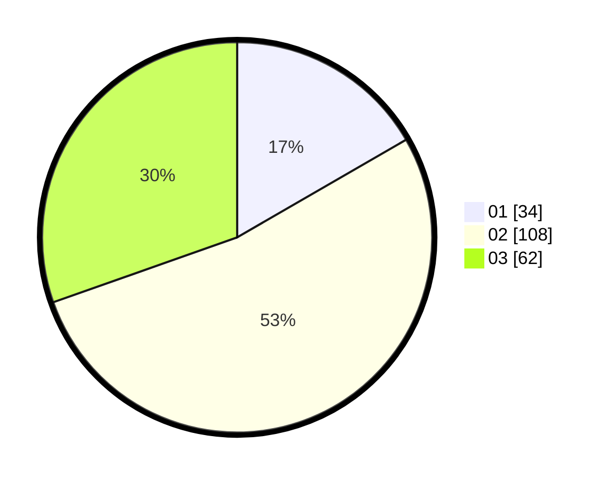

# Hasil

Hasil perolehan suara paslon dapat dilihat pada file paslon-01.txt, paslon-02.txt, dan paslon-03.txt.

Jika tidak ada, artinya data tersebut belum ada pada SIREKAP.

## Perolehan Suara

 * Paslon 01: **34**.
 * Paslon 02: **108**.
 * Paslon 03: **62**.

## Foto C Plano

https://sirekap-obj-formc.kpu.go.id/db1e/pemilu/ppwp/31/73/04/10/09/3173041009085-20240215-052431--88c9951a-6093-4cf6-88af-8ef0f5649a61.jpg

https://sirekap-obj-formc.kpu.go.id/db1e/pemilu/ppwp/31/73/04/10/09/3173041009085-20240215-051251--c3601b49-c08d-4713-92e6-d1fc97c1c323.jpg

https://sirekap-obj-formc.kpu.go.id/db1e/pemilu/ppwp/31/73/04/10/09/3173041009085-20240214-223832--71480cf5-fba5-4cad-b622-5c5ed1accbb8.jpg
