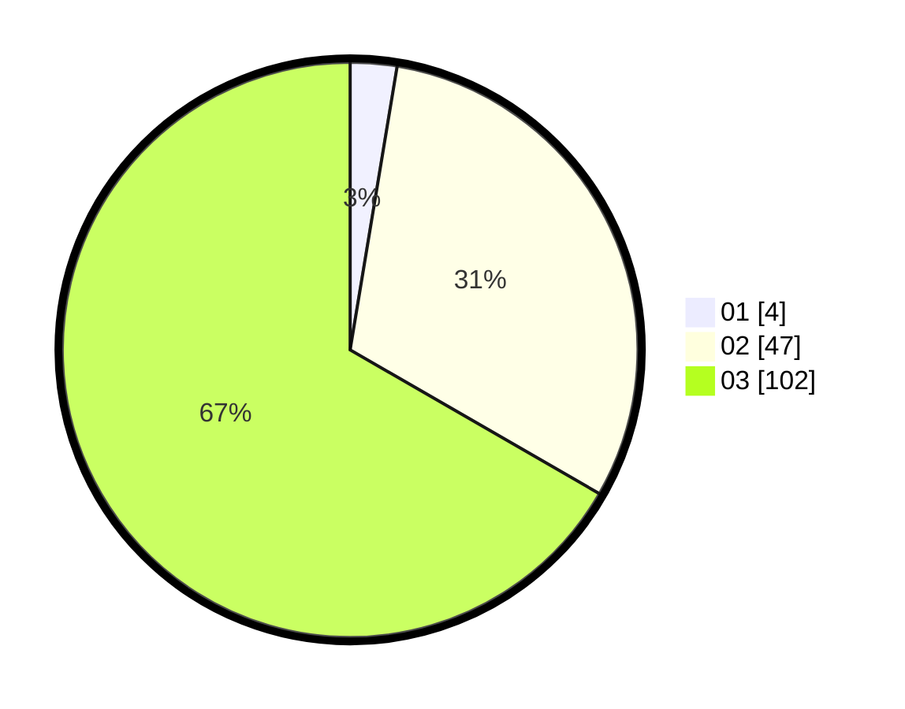

# Hasil

Hasil perolehan suara paslon dapat dilihat pada file paslon-01.txt, paslon-02.txt, dan paslon-03.txt.

Jika tidak ada, artinya data tersebut belum ada pada SIREKAP.

## Perolehan Suara

 * Paslon 01: **4**.
 * Paslon 02: **47**.
 * Paslon 03: **102**.

## Foto C Plano

https://sirekap-obj-formc.kpu.go.id/6efc/pemilu/ppwp/31/73/04/10/10/3173041010001-20240215-191707--a5361319-facd-4785-936d-ce602c6fecda.jpg

https://sirekap-obj-formc.kpu.go.id/6efc/pemilu/ppwp/31/73/04/10/10/3173041010001-20240215-191728--d4adb758-6f4a-4c43-a47a-8552a6b5979c.jpg

https://sirekap-obj-formc.kpu.go.id/6efc/pemilu/ppwp/31/73/04/10/10/3173041010001-20240215-191718--8508ba47-017b-4453-9e99-8b4bd7ec92b5.jpg

## DATA PEMILIH TETAP

Jumlah pemilih dalam DPT: **216**.
 * L: **105**.
 * P: **111**.

## DATA PENGGUNA HAK PILIH

Jumlah pengguna hak pilih dalam DPT: **153**.
 * L: **74**.
 * P: **79**.

Jumlah pengguna hak pilih dalam DPTb: **6**.
 * L: **5**.
 * P: **1**.

Jumlah pengguna hak pilih dalam DPK: **1**.
 * L: **0**.
 * P: **1**.

Jumlah pengguna hak pilih: **160**.
 * L: **79**.
 * P: **81**.

## JUMLAH SUARA SAH DAN TIDAK SAH

JUMLAH SELURUH SUARA SAH: **153**.

JUMLAH SUARA TIDAK SAH: **7**.

JUMLAH SELURUH SUARA SAH DAN SUARA TIDAK SAH: **160**.
