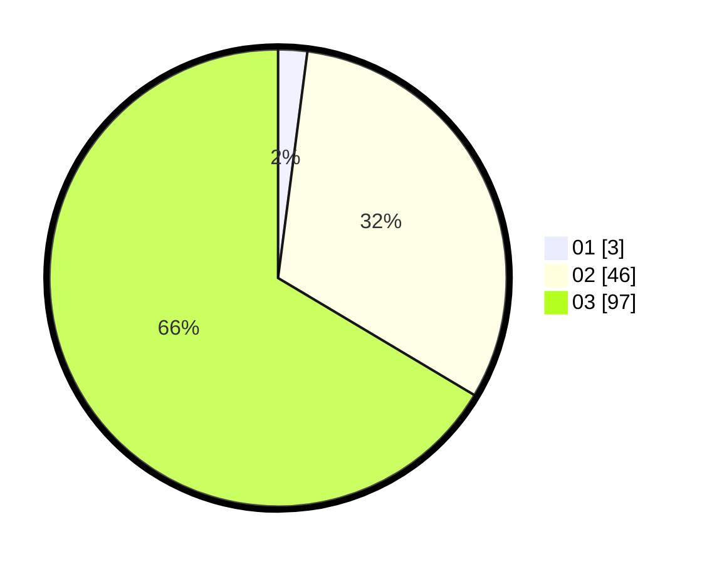

# Hasil

Hasil perolehan suara paslon dapat dilihat pada file paslon-01.txt, paslon-02.txt, dan paslon-03.txt.

Jika tidak ada, artinya data tersebut belum ada pada SIREKAP.

## Perolehan Suara

 * Paslon 01: **3**.
 * Paslon 02: **46**.
 * Paslon 03: **97**.

## Foto C Plano

https://sirekap-obj-formc.kpu.go.id/2cce/pemilu/ppwp/31/73/04/10/10/3173041010002-20240215-164622--75c9d43e-9628-46c1-851a-b1636abfbf24.jpg

https://sirekap-obj-formc.kpu.go.id/2cce/pemilu/ppwp/31/73/04/10/10/3173041010002-20240216-010009--8c5835f8-dffe-47cd-a8a0-5a2494504ea4.jpg

https://sirekap-obj-formc.kpu.go.id/2cce/pemilu/ppwp/31/73/04/10/10/3173041010002-20240216-010008--6731c91f-3d0f-4296-a955-f25aec4804b4.jpg

## DATA PEMILIH TETAP

Jumlah pemilih dalam DPT: **214**.
 * L: **100**.
 * P: **114**.

## DATA PENGGUNA HAK PILIH

Jumlah pengguna hak pilih dalam DPT: **140**.
 * L: **65**.
 * P: **75**.

Jumlah pengguna hak pilih dalam DPTb: **5**.
 * L: **3**.
 * P: **2**.

Jumlah pengguna hak pilih dalam DPK: **2**.
 * L: **1**.
 * P: **1**.

Jumlah pengguna hak pilih: **147**.
 * L: **69**.
 * P: **78**.

## JUMLAH SUARA SAH DAN TIDAK SAH

JUMLAH SELURUH SUARA SAH: **146**.

JUMLAH SUARA TIDAK SAH: **1**.

JUMLAH SELURUH SUARA SAH DAN SUARA TIDAK SAH: **147**.
