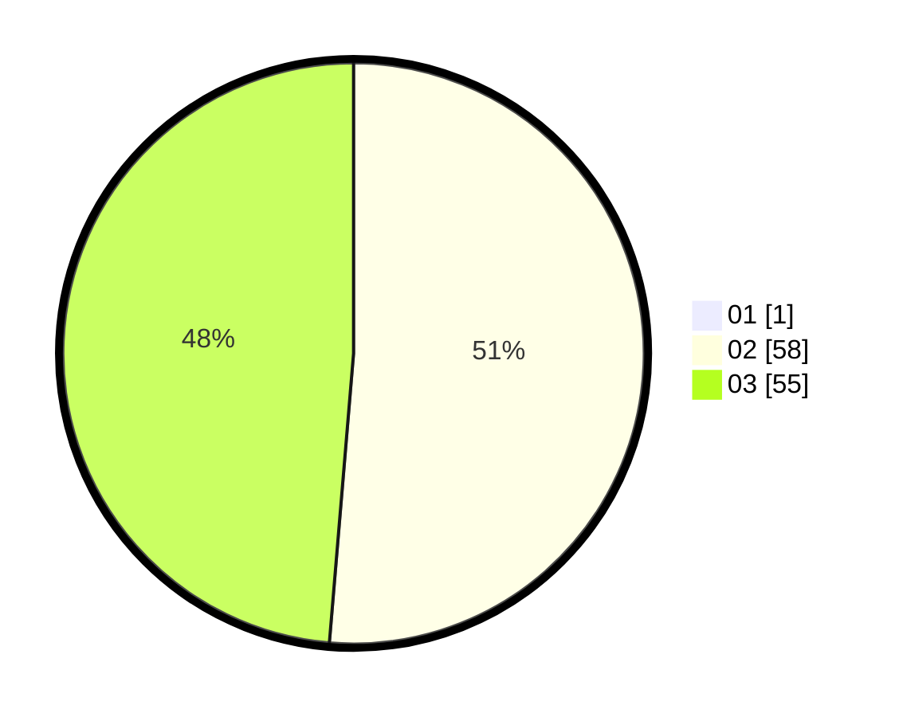

# Hasil

Hasil perolehan suara paslon dapat dilihat pada file paslon-01.txt, paslon-02.txt, dan paslon-03.txt.

Jika tidak ada, artinya data tersebut belum ada pada SIREKAP.

## Perolehan Suara

 * Paslon 01: **1**.
 * Paslon 02: **58**.
 * Paslon 03: **55**.

## Foto C Plano

https://sirekap-obj-formc.kpu.go.id/602b/pemilu/ppwp/31/73/04/10/10/3173041010006-20240216-021334--b5d13b34-7fc1-4fa4-af93-85165a974e0b.jpg

https://sirekap-obj-formc.kpu.go.id/602b/pemilu/ppwp/31/73/04/10/10/3173041010006-20240216-021335--02ba1c1b-0806-4060-993a-c475de83a5dc.jpg

https://sirekap-obj-formc.kpu.go.id/602b/pemilu/ppwp/31/73/04/10/10/3173041010006-20240216-021334--2145569c-7657-4913-93a5-2aba2f8d2cd5.jpg

## DATA PEMILIH TETAP

Jumlah pemilih dalam DPT: **185**.
 * L: **82**.
 * P: **103**.

## DATA PENGGUNA HAK PILIH

Jumlah pengguna hak pilih dalam DPT: **110**.
 * L: **43**.
 * P: **67**.

Jumlah pengguna hak pilih dalam DPTb: **5**.
 * L: **1**.
 * P: **4**.

Jumlah pengguna hak pilih dalam DPK: **2**.
 * L: **0**.
 * P: **2**.

Jumlah pengguna hak pilih: **117**.
 * L: **44**.
 * P: **73**.

## JUMLAH SUARA SAH DAN TIDAK SAH

JUMLAH SELURUH SUARA SAH: **114**.

JUMLAH SUARA TIDAK SAH: **3**.

JUMLAH SELURUH SUARA SAH DAN SUARA TIDAK SAH: **117**.
