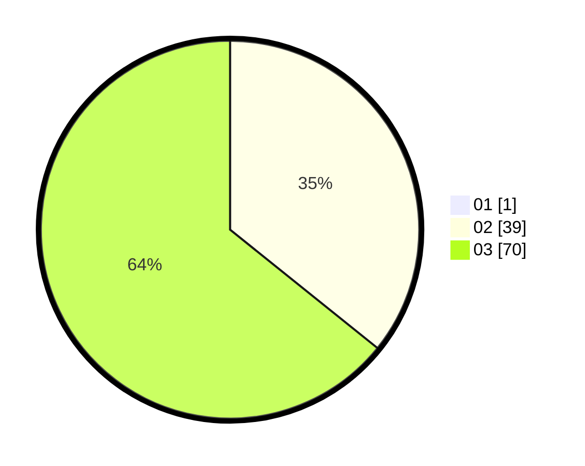

# Hasil

Hasil perolehan suara paslon dapat dilihat pada file paslon-01.txt, paslon-02.txt, dan paslon-03.txt.

Jika tidak ada, artinya data tersebut belum ada pada SIREKAP.

## Perolehan Suara

 * Paslon 01: **1**.
 * Paslon 02: **39**.
 * Paslon 03: **70**.

## Foto C Plano

https://sirekap-obj-formc.kpu.go.id/b903/pemilu/ppwp/31/73/04/10/10/3173041010007-20240215-233620--6a748bef-0daf-4e9b-a802-54ef13e43a96.jpg

https://sirekap-obj-formc.kpu.go.id/b903/pemilu/ppwp/31/73/04/10/10/3173041010007-20240215-233622--9b0e272e-a127-435a-828f-4ecec0c2da9f.jpg

https://sirekap-obj-formc.kpu.go.id/b903/pemilu/ppwp/31/73/04/10/10/3173041010007-20240215-233621--ccd76be7-5f2d-4186-b0f1-4d2693a10fc5.jpg

## DATA PEMILIH TETAP

Jumlah pemilih dalam DPT: **182**.
 * L: **93**.
 * P: **89**.

## DATA PENGGUNA HAK PILIH

Jumlah pengguna hak pilih dalam DPT: **108**.
 * L: **62**.
 * P: **46**.

Jumlah pengguna hak pilih dalam DPTb: **5**.
 * L: **3**.
 * P: **2**.

Jumlah pengguna hak pilih dalam DPK: **2**.
 * L: **2**.
 * P: **0**.

Jumlah pengguna hak pilih: **115**.
 * L: **67**.
 * P: **48**.

## JUMLAH SUARA SAH DAN TIDAK SAH

JUMLAH SELURUH SUARA SAH: **110**.

JUMLAH SUARA TIDAK SAH: **5**.

JUMLAH SELURUH SUARA SAH DAN SUARA TIDAK SAH: **115**.
