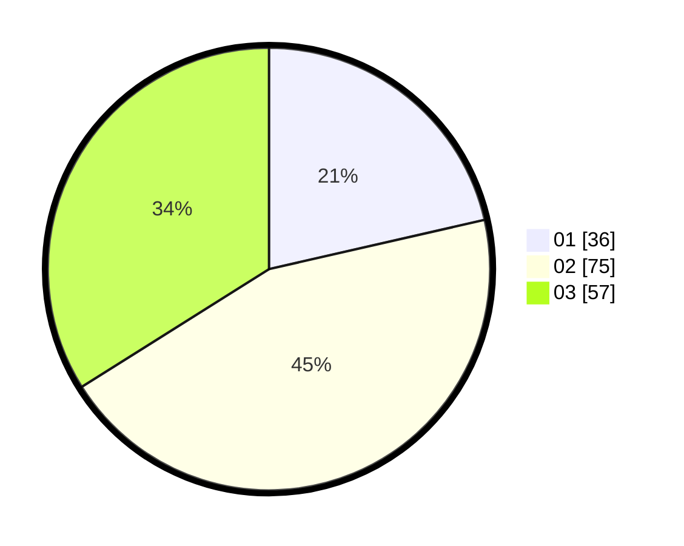

# Hasil

Hasil perolehan suara paslon dapat dilihat pada file paslon-01.txt, paslon-02.txt, dan paslon-03.txt.

Jika tidak ada, artinya data tersebut belum ada pada SIREKAP.

## Perolehan Suara

 * Paslon 01: **36**.
 * Paslon 02: **75**.
 * Paslon 03: **57**.

## Foto C Plano

https://sirekap-obj-formc.kpu.go.id/005b/pemilu/ppwp/31/73/04/10/10/3173041010011-20240216-052131--8e3803ae-0471-45a5-9676-6961fb2742dd.jpg

https://sirekap-obj-formc.kpu.go.id/005b/pemilu/ppwp/31/73/04/10/10/3173041010011-20240216-052132--985b3970-030e-4f53-8891-86debbdc64ad.jpg

https://sirekap-obj-formc.kpu.go.id/005b/pemilu/ppwp/31/73/04/10/10/3173041010011-20240216-022404--13eec8c5-ec70-49fd-9e4d-64c43bb58e22.jpg

## DATA PEMILIH TETAP

Jumlah pemilih dalam DPT: **240**.
 * L: **125**.
 * P: **115**.

## DATA PENGGUNA HAK PILIH

Jumlah pengguna hak pilih dalam DPT: **164**.
 * L: **78**.
 * P: **86**.

Jumlah pengguna hak pilih dalam DPTb: **5**.
 * L: **1**.
 * P: **4**.

Jumlah pengguna hak pilih dalam DPK: **1**.
 * L: **0**.
 * P: **1**.

Jumlah pengguna hak pilih: **170**.
 * L: **79**.
 * P: **91**.

## JUMLAH SUARA SAH DAN TIDAK SAH

JUMLAH SELURUH SUARA SAH: **168**.

JUMLAH SUARA TIDAK SAH: **2**.

JUMLAH SELURUH SUARA SAH DAN SUARA TIDAK SAH: **170**.
