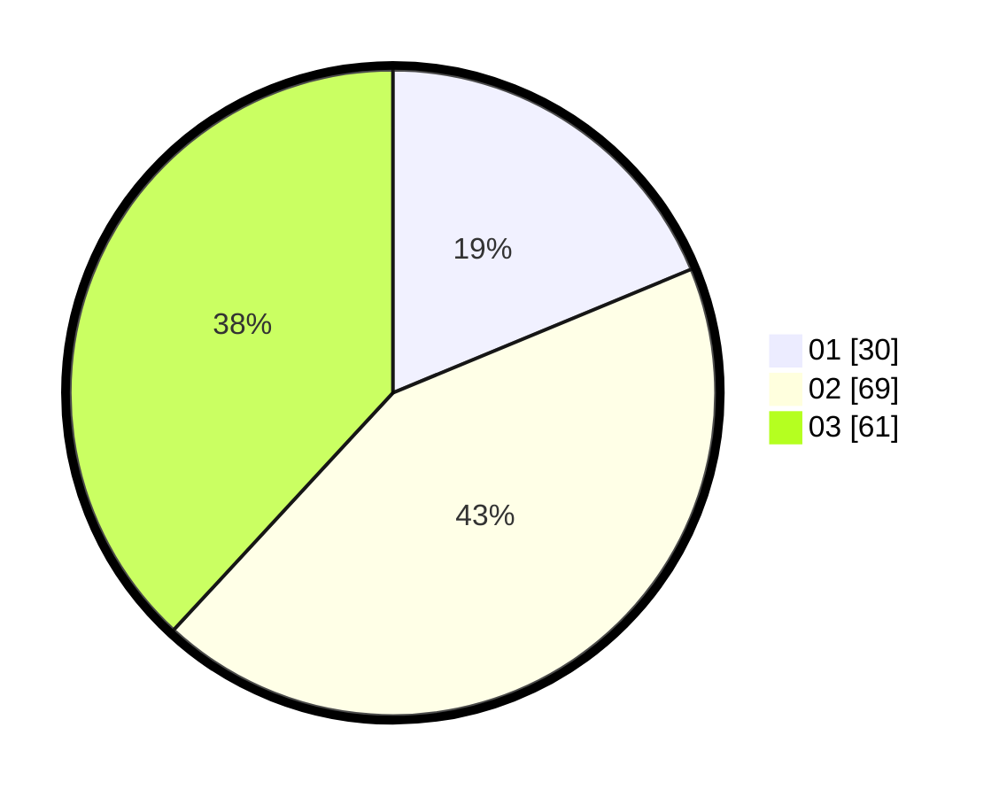

# Hasil

Hasil perolehan suara paslon dapat dilihat pada file paslon-01.txt, paslon-02.txt, dan paslon-03.txt.

Jika tidak ada, artinya data tersebut belum ada pada SIREKAP.

## Perolehan Suara

 * Paslon 01: **30**.
 * Paslon 02: **69**.
 * Paslon 03: **61**.

## Foto C Plano

https://sirekap-obj-formc.kpu.go.id/7a05/pemilu/ppwp/31/73/04/10/11/3173041011004-20240216-160506--c91a8869-74cc-4060-9087-2725e2f72bf7.jpg

https://sirekap-obj-formc.kpu.go.id/7a05/pemilu/ppwp/31/73/04/10/11/3173041011004-20240216-160507--a6917345-e07d-46f7-a2cb-8fbe788108d0.jpg

https://sirekap-obj-formc.kpu.go.id/7a05/pemilu/ppwp/31/73/04/10/11/3173041011004-20240216-160506--3f982701-6484-4a54-bdd4-317a2113d193.jpg

## DATA PEMILIH TETAP

Jumlah pemilih dalam DPT: **204**.
 * L: **91**.
 * P: **113**.

## DATA PENGGUNA HAK PILIH

Jumlah pengguna hak pilih dalam DPT: **161**.
 * L: **74**.
 * P: **87**.

Jumlah pengguna hak pilih dalam DPTb: **1**.
 * L: **1**.
 * P: **0**.

Jumlah pengguna hak pilih dalam DPK: **2**.
 * L: **1**.
 * P: **1**.

Jumlah pengguna hak pilih: **164**.
 * L: **76**.
 * P: **88**.

## JUMLAH SUARA SAH DAN TIDAK SAH

JUMLAH SELURUH SUARA SAH: **160**.

JUMLAH SUARA TIDAK SAH: **4**.

JUMLAH SELURUH SUARA SAH DAN SUARA TIDAK SAH: **164**.
