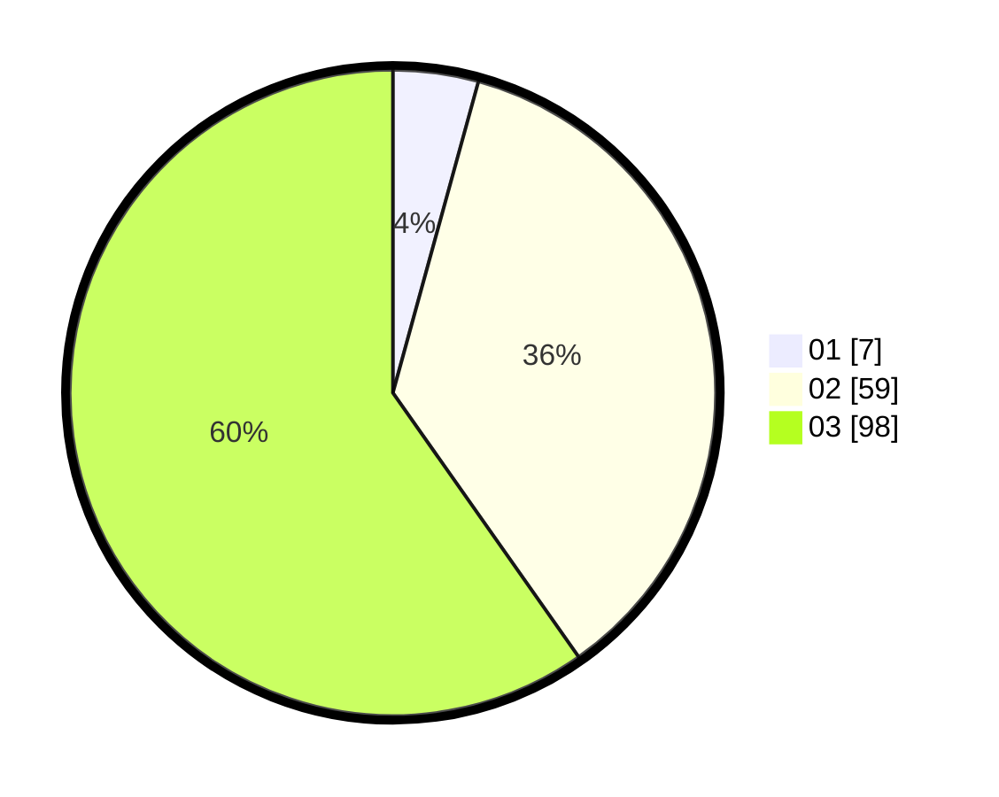

# Hasil

Hasil perolehan suara paslon dapat dilihat pada file paslon-01.txt, paslon-02.txt, dan paslon-03.txt.

Jika tidak ada, artinya data tersebut belum ada pada SIREKAP.

## Perolehan Suara

 * Paslon 01: **7**.
 * Paslon 02: **59**.
 * Paslon 03: **98**.

## Foto C Plano

https://sirekap-obj-formc.kpu.go.id/4bc3/pemilu/ppwp/31/73/04/10/11/3173041011007-20240214-191241--102dd752-b1a0-4a74-b32c-995577c037e4.jpg

https://sirekap-obj-formc.kpu.go.id/4bc3/pemilu/ppwp/31/73/04/10/11/3173041011007-20240214-155330--bb94138c-5ecc-4c68-b32c-29c0f1c29781.jpg

https://sirekap-obj-formc.kpu.go.id/4bc3/pemilu/ppwp/31/73/04/10/11/3173041011007-20240214-155339--3335c9e7-bc77-498a-9050-dc9c83b1a039.jpg

## DATA PEMILIH TETAP

Jumlah pemilih dalam DPT: **257**.
 * L: **109**.
 * P: **148**.

## DATA PENGGUNA HAK PILIH

Jumlah pengguna hak pilih dalam DPT: **170**.
 * L: **68**.
 * P: **102**.

Jumlah pengguna hak pilih dalam DPTb: **0**.
 * L: **0**.
 * P: **0**.

Jumlah pengguna hak pilih dalam DPK: **1**.
 * L: **1**.
 * P: **0**.

Jumlah pengguna hak pilih: **171**.
 * L: **69**.
 * P: **102**.

## JUMLAH SUARA SAH DAN TIDAK SAH

JUMLAH SELURUH SUARA SAH: **164**.

JUMLAH SUARA TIDAK SAH: **7**.

JUMLAH SELURUH SUARA SAH DAN SUARA TIDAK SAH: **171**.
