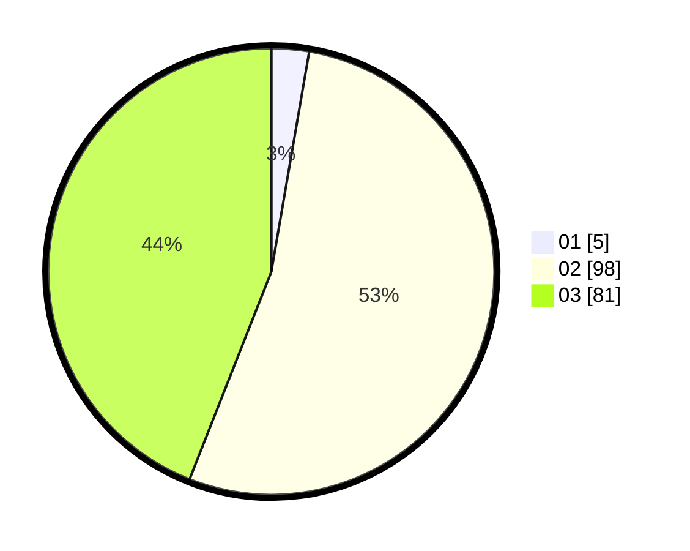

# Hasil

Hasil perolehan suara paslon dapat dilihat pada file paslon-01.txt, paslon-02.txt, dan paslon-03.txt.

Jika tidak ada, artinya data tersebut belum ada pada SIREKAP.

## Perolehan Suara

 * Paslon 01: **5**.
 * Paslon 02: **98**.
 * Paslon 03: **81**.

## Foto C Plano

https://sirekap-obj-formc.kpu.go.id/cbae/pemilu/ppwp/31/73/04/10/11/3173041011010-20240214-190400--c999e677-7d2d-49c0-9fb0-9857ecdc7992.jpg

https://sirekap-obj-formc.kpu.go.id/cbae/pemilu/ppwp/31/73/04/10/11/3173041011010-20240214-190414--082bfe98-091d-45d4-b93d-da1986b4614b.jpg

https://sirekap-obj-formc.kpu.go.id/cbae/pemilu/ppwp/31/73/04/10/11/3173041011010-20240214-190421--ea4802c0-a0d3-486b-a203-0903fa3ba9dd.jpg

## DATA PEMILIH TETAP

Jumlah pemilih dalam DPT: **278**.
 * L: **134**.
 * P: **144**.

## DATA PENGGUNA HAK PILIH

Jumlah pengguna hak pilih dalam DPT: **187**.
 * L: **86**.
 * P: **101**.

Jumlah pengguna hak pilih dalam DPTb: **0**.
 * L: **0**.
 * P: **0**.

Jumlah pengguna hak pilih dalam DPK: **1**.
 * L: **1**.
 * P: **0**.

Jumlah pengguna hak pilih: **188**.
 * L: **87**.
 * P: **101**.

## JUMLAH SUARA SAH DAN TIDAK SAH

JUMLAH SELURUH SUARA SAH: **184**.

JUMLAH SUARA TIDAK SAH: **4**.

JUMLAH SELURUH SUARA SAH DAN SUARA TIDAK SAH: **188**.
