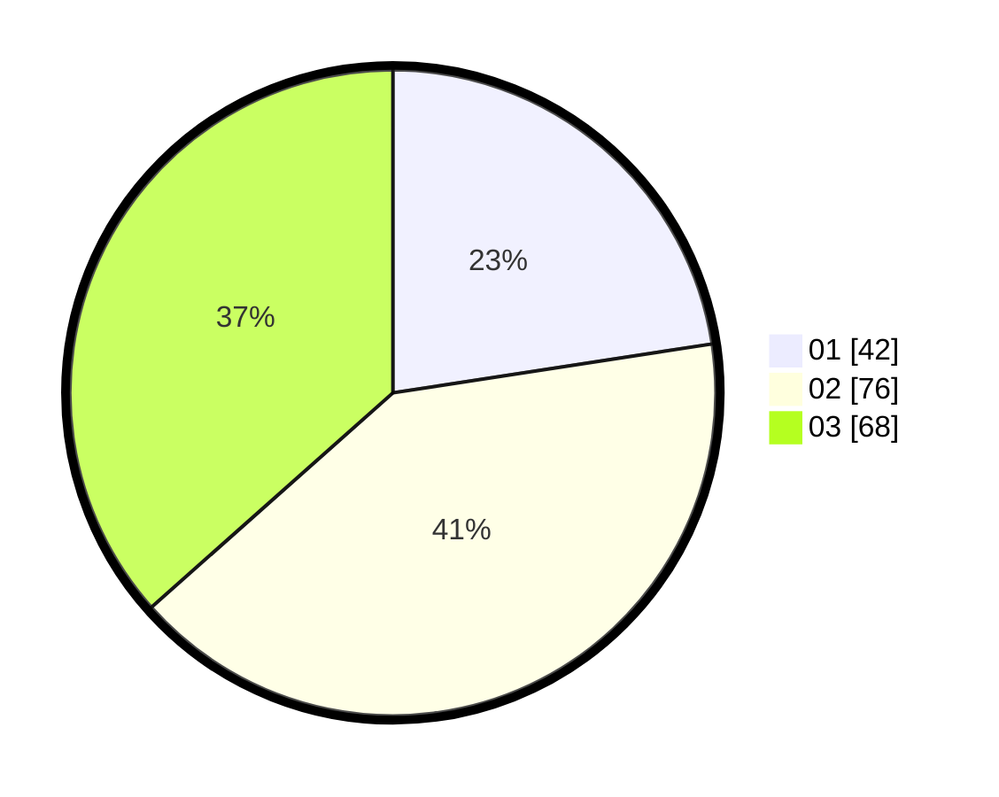

# Hasil

Hasil perolehan suara paslon dapat dilihat pada file paslon-01.txt, paslon-02.txt, dan paslon-03.txt.

Jika tidak ada, artinya data tersebut belum ada pada SIREKAP.

## Perolehan Suara

 * Paslon 01: **42**.
 * Paslon 02: **76**.
 * Paslon 03: **68**.

## Foto C Plano

https://sirekap-obj-formc.kpu.go.id/1b8e/pemilu/ppwp/31/73/04/10/11/3173041011012-20240214-234917--c3e4e5ef-816a-4d7a-9b38-760b975dbe86.jpg

https://sirekap-obj-formc.kpu.go.id/1b8e/pemilu/ppwp/31/73/04/10/11/3173041011012-20240214-235317--ebc3ca16-6772-4020-96d6-72b63c28aacf.jpg

https://sirekap-obj-formc.kpu.go.id/1b8e/pemilu/ppwp/31/73/04/10/11/3173041011012-20240214-235625--406a0574-ce97-44f5-98da-0e082b8cb079.jpg
