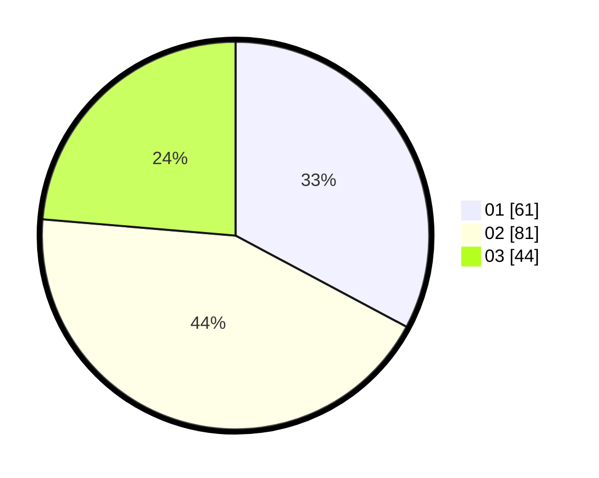

# Hasil

Hasil perolehan suara paslon dapat dilihat pada file paslon-01.txt, paslon-02.txt, dan paslon-03.txt.

Jika tidak ada, artinya data tersebut belum ada pada SIREKAP.

## Perolehan Suara

 * Paslon 01: **61**.
 * Paslon 02: **81**.
 * Paslon 03: **44**.

## Foto C Plano

https://sirekap-obj-formc.kpu.go.id/9a31/pemilu/ppwp/31/73/04/10/11/3173041011013-20240214-195545--34e5fc5b-e319-4c31-9ec7-460f03c6893f.jpg

https://sirekap-obj-formc.kpu.go.id/9a31/pemilu/ppwp/31/73/04/10/11/3173041011013-20240214-220202--7b5e2a8f-51ae-48c6-8870-790e7a92df85.jpg

https://sirekap-obj-formc.kpu.go.id/9a31/pemilu/ppwp/31/73/04/10/11/3173041011013-20240214-220303--13ac47e9-9043-431b-86b7-a62ce3b6a3ba.jpg
