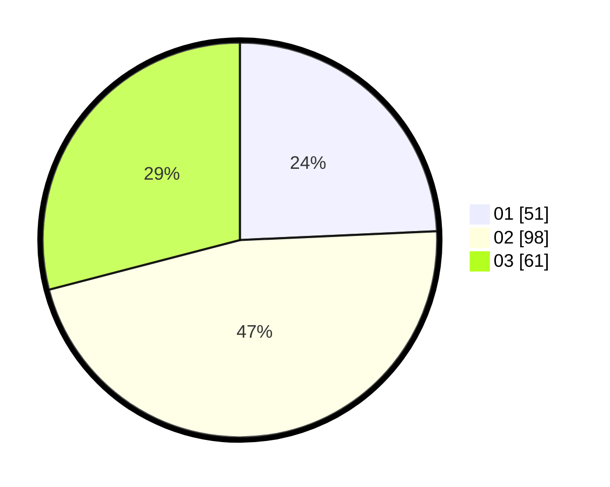

# Hasil

Hasil perolehan suara paslon dapat dilihat pada file paslon-01.txt, paslon-02.txt, dan paslon-03.txt.

Jika tidak ada, artinya data tersebut belum ada pada SIREKAP.

## Perolehan Suara

 * Paslon 01: **51**.
 * Paslon 02: **98**.
 * Paslon 03: **61**.

## Foto C Plano

https://sirekap-obj-formc.kpu.go.id/4e58/pemilu/ppwp/31/73/04/10/11/3173041011015-20240214-222148--9a790d32-9b49-49cb-aeff-61abefc3a38b.jpg

https://sirekap-obj-formc.kpu.go.id/4e58/pemilu/ppwp/31/73/04/10/11/3173041011015-20240214-210058--bdcf5099-ec0d-42de-b061-ae60e1cd7db5.jpg
