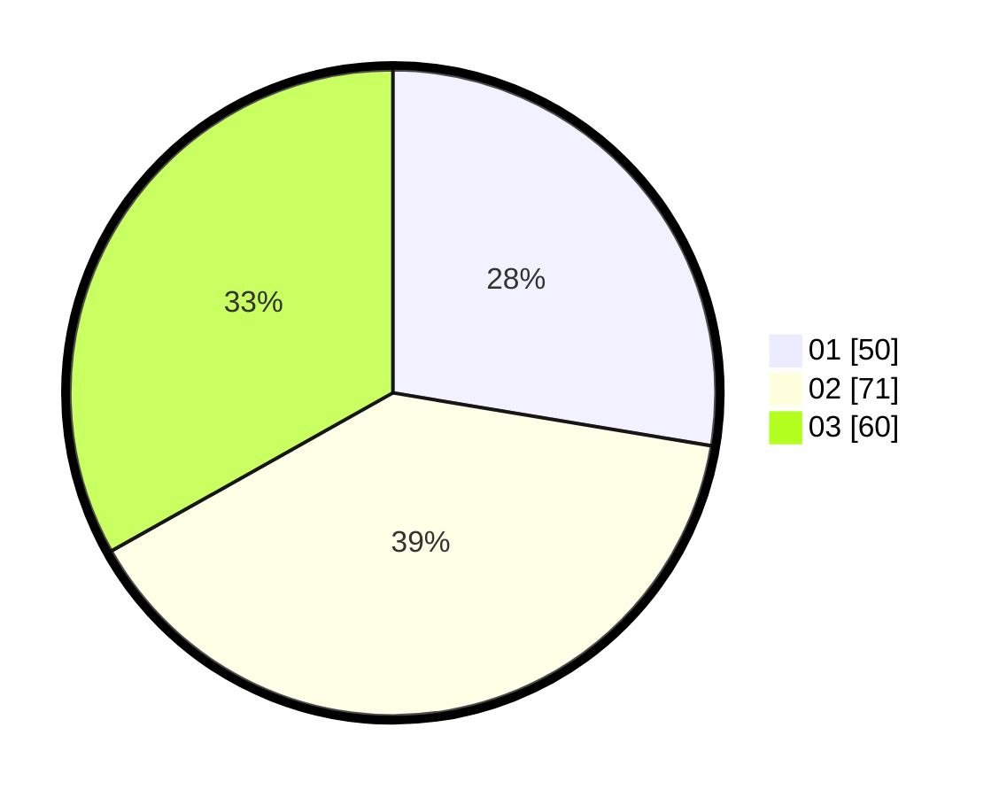

# Hasil

Hasil perolehan suara paslon dapat dilihat pada file paslon-01.txt, paslon-02.txt, dan paslon-03.txt.

Jika tidak ada, artinya data tersebut belum ada pada SIREKAP.

## Perolehan Suara

 * Paslon 01: **50**.
 * Paslon 02: **71**.
 * Paslon 03: **60**.

## Foto C Plano

https://sirekap-obj-formc.kpu.go.id/7327/pemilu/ppwp/31/73/04/10/11/3173041011016-20240215-024645--3ee4119c-6b08-4923-b924-0e42187e8c03.jpg

https://sirekap-obj-formc.kpu.go.id/7327/pemilu/ppwp/31/73/04/10/11/3173041011016-20240215-024706--7fdad227-60cf-4942-81ec-1ca18101f520.jpg

https://sirekap-obj-formc.kpu.go.id/7327/pemilu/ppwp/31/73/04/10/11/3173041011016-20240215-024656--a66f93dc-f9cd-45e4-91ba-9a88562f665a.jpg

## DATA PEMILIH TETAP

Jumlah pemilih dalam DPT: **240**.
 * L: **108**.
 * P: **132**.

## DATA PENGGUNA HAK PILIH

Jumlah pengguna hak pilih dalam DPT: **184**.
 * L: **94**.
 * P: **90**.

Jumlah pengguna hak pilih dalam DPTb: **0**.
 * L: **0**.
 * P: **0**.

Jumlah pengguna hak pilih dalam DPK: **2**.
 * L: **1**.
 * P: **1**.

Jumlah pengguna hak pilih: **186**.
 * L: **95**.
 * P: **91**.

## JUMLAH SUARA SAH DAN TIDAK SAH

JUMLAH SELURUH SUARA SAH: **181**.

JUMLAH SUARA TIDAK SAH: **5**.

JUMLAH SELURUH SUARA SAH DAN SUARA TIDAK SAH: **186**.
