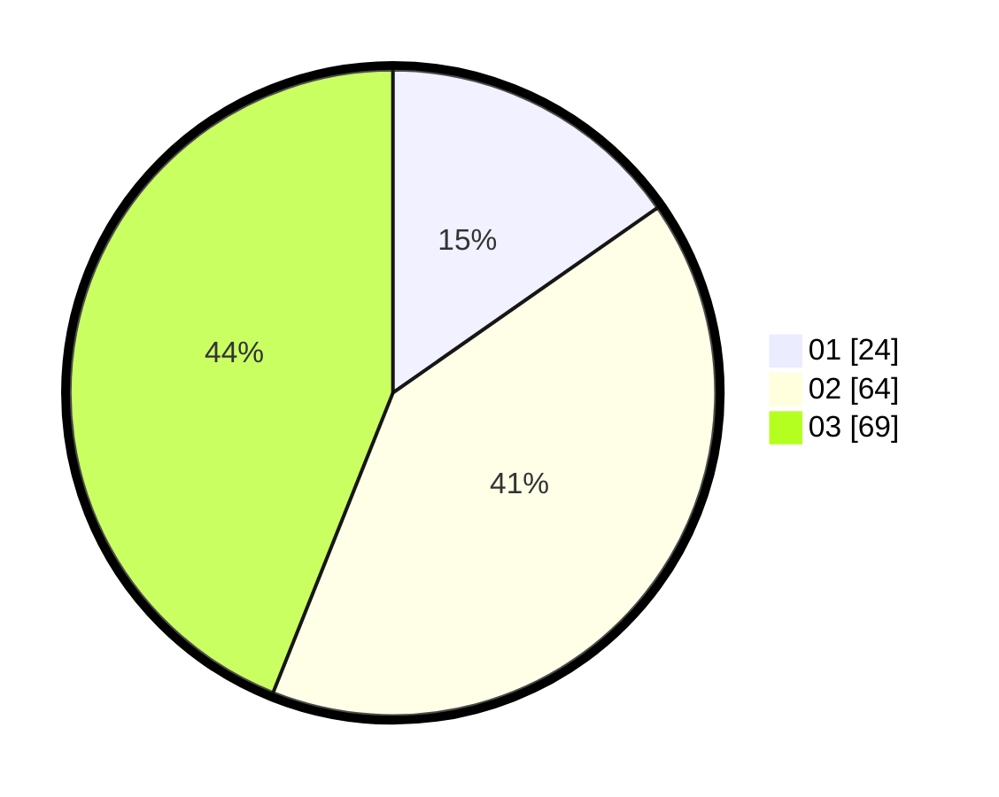

# Hasil

Hasil perolehan suara paslon dapat dilihat pada file paslon-01.txt, paslon-02.txt, dan paslon-03.txt.

Jika tidak ada, artinya data tersebut belum ada pada SIREKAP.

## Perolehan Suara

 * Paslon 01: **24**.
 * Paslon 02: **64**.
 * Paslon 03: **69**.

## Foto C Plano

https://sirekap-obj-formc.kpu.go.id/3f4c/pemilu/ppwp/31/73/04/10/11/3173041011017-20240215-214904--3656c4c4-f9ce-4710-ba90-ba85aa544dcf.jpg

https://sirekap-obj-formc.kpu.go.id/3f4c/pemilu/ppwp/31/73/04/10/11/3173041011017-20240215-214907--6c1bf2e5-f2cf-44c0-b8a6-1f9c05d0f4d0.jpg

https://sirekap-obj-formc.kpu.go.id/3f4c/pemilu/ppwp/31/73/04/10/11/3173041011017-20240215-214906--91f998f5-8ca2-46b1-a79c-ce6442451768.jpg

## DATA PEMILIH TETAP

Jumlah pemilih dalam DPT: **213**.
 * L: **93**.
 * P: **120**.

## DATA PENGGUNA HAK PILIH

Jumlah pengguna hak pilih dalam DPT: **158**.
 * L: **67**.
 * P: **91**.

Jumlah pengguna hak pilih dalam DPTb: **2**.
 * L: **1**.
 * P: **1**.

Jumlah pengguna hak pilih dalam DPK: **0**.
 * L: **0**.
 * P: **0**.

Jumlah pengguna hak pilih: **160**.
 * L: **68**.
 * P: **92**.

## JUMLAH SUARA SAH DAN TIDAK SAH

JUMLAH SELURUH SUARA SAH: **157**.

JUMLAH SUARA TIDAK SAH: **3**.

JUMLAH SELURUH SUARA SAH DAN SUARA TIDAK SAH: **160**.
