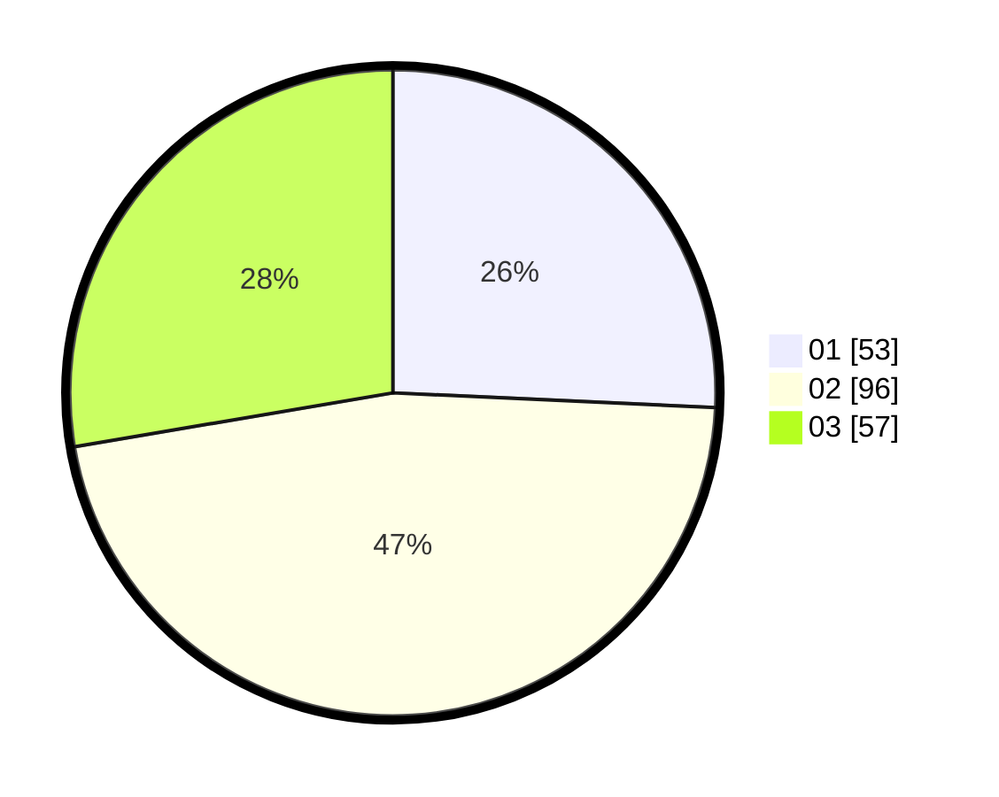

# Hasil

Hasil perolehan suara paslon dapat dilihat pada file paslon-01.txt, paslon-02.txt, dan paslon-03.txt.

Jika tidak ada, artinya data tersebut belum ada pada SIREKAP.

## Perolehan Suara

 * Paslon 01: **53**.
 * Paslon 02: **96**.
 * Paslon 03: **57**.

## Foto C Plano

https://sirekap-obj-formc.kpu.go.id/a6d7/pemilu/ppwp/31/73/04/10/11/3173041011021-20240216-025731--e0446e68-6f3b-4831-a727-697f74d0d874.jpg

https://sirekap-obj-formc.kpu.go.id/a6d7/pemilu/ppwp/31/73/04/10/11/3173041011021-20240216-025739--beb6b200-d43a-42db-9a46-4d5c8b26b576.jpg

https://sirekap-obj-formc.kpu.go.id/a6d7/pemilu/ppwp/31/73/04/10/11/3173041011021-20240216-025736--70bf3d15-664f-4ba9-8521-50763c3d238e.jpg

## DATA PEMILIH TETAP

Jumlah pemilih dalam DPT: **267**.
 * L: **133**.
 * P: **134**.

## DATA PENGGUNA HAK PILIH

Jumlah pengguna hak pilih dalam DPT: **205**.
 * L: **95**.
 * P: **110**.

Jumlah pengguna hak pilih dalam DPTb: **5**.
 * L: **4**.
 * P: **1**.

Jumlah pengguna hak pilih dalam DPK: **0**.
 * L: **0**.
 * P: **0**.

Jumlah pengguna hak pilih: **210**.
 * L: **99**.
 * P: **111**.

## JUMLAH SUARA SAH DAN TIDAK SAH

JUMLAH SELURUH SUARA SAH: **206**.

JUMLAH SUARA TIDAK SAH: **5**.

JUMLAH SELURUH SUARA SAH DAN SUARA TIDAK SAH: **211**.
