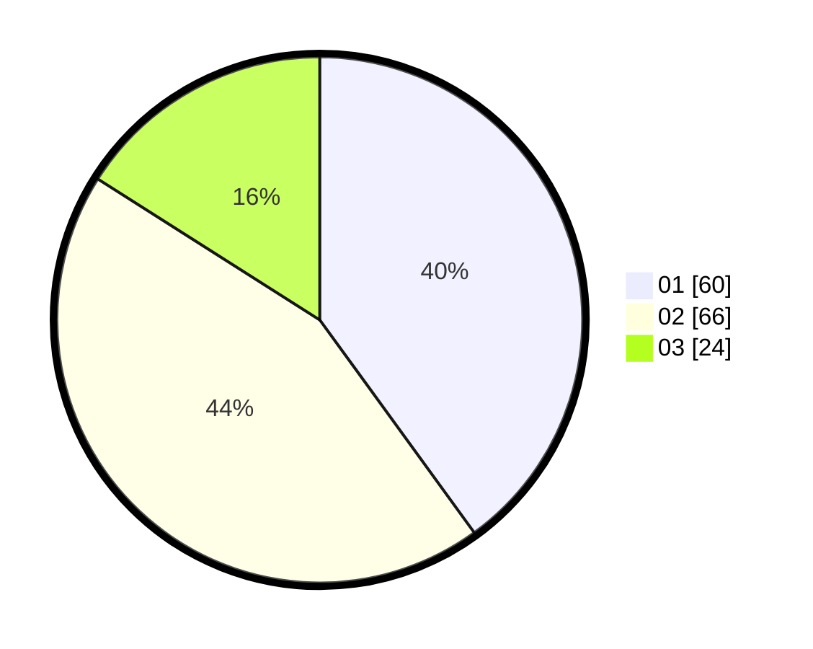

# Hasil

Hasil perolehan suara paslon dapat dilihat pada file paslon-01.txt, paslon-02.txt, dan paslon-03.txt.

Jika tidak ada, artinya data tersebut belum ada pada SIREKAP.

## Perolehan Suara

 * Paslon 01: **60**.
 * Paslon 02: **66**.
 * Paslon 03: **24**.

## Foto C Plano

https://sirekap-obj-formc.kpu.go.id/de8a/pemilu/ppwp/31/73/04/10/11/3173041011024-20240214-194026--7cb3ae35-85e2-4147-8200-d4f823666683.jpg

https://sirekap-obj-formc.kpu.go.id/de8a/pemilu/ppwp/31/73/04/10/11/3173041011024-20240214-232117--437248db-0e7a-4e51-b31b-8f0dcf65e1e0.jpg

https://sirekap-obj-formc.kpu.go.id/de8a/pemilu/ppwp/31/73/04/10/11/3173041011024-20240214-232224--6f26af9e-2b1b-4a20-bb5d-1f9fa439ea85.jpg

## DATA PEMILIH TETAP

Jumlah pemilih dalam DPT: **207**.
 * L: **112**.
 * P: **95**.

## DATA PENGGUNA HAK PILIH

Jumlah pengguna hak pilih dalam DPT: **150**.
 * L: **80**.
 * P: **70**.

Jumlah pengguna hak pilih dalam DPTb: **1**.
 * L: **0**.
 * P: **1**.

Jumlah pengguna hak pilih dalam DPK: **1**.
 * L: **1**.
 * P: **0**.

Jumlah pengguna hak pilih: **152**.
 * L: **81**.
 * P: **71**.

## JUMLAH SUARA SAH DAN TIDAK SAH

JUMLAH SELURUH SUARA SAH: **150**.

JUMLAH SUARA TIDAK SAH: **2**.

JUMLAH SELURUH SUARA SAH DAN SUARA TIDAK SAH: **152**.
