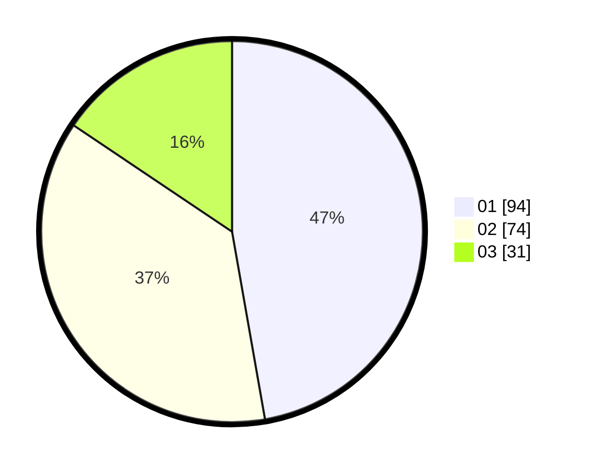

# Hasil

Hasil perolehan suara paslon dapat dilihat pada file paslon-01.txt, paslon-02.txt, dan paslon-03.txt.

Jika tidak ada, artinya data tersebut belum ada pada SIREKAP.

## Perolehan Suara

 * Paslon 01: **94**.
 * Paslon 02: **74**.
 * Paslon 03: **31**.

## Foto C Plano

https://sirekap-obj-formc.kpu.go.id/48e6/pemilu/ppwp/31/73/04/10/11/3173041011028-20240216-012643--f3895f89-0425-4694-a428-2bacece04bb7.jpg

https://sirekap-obj-formc.kpu.go.id/48e6/pemilu/ppwp/31/73/04/10/11/3173041011028-20240216-012645--aab12eed-1d7d-4013-b353-4b9ed6b1485d.jpg

https://sirekap-obj-formc.kpu.go.id/48e6/pemilu/ppwp/31/73/04/10/11/3173041011028-20240216-012644--45a5bb7f-97ee-4344-9031-4cbc4ddf9e7a.jpg

## DATA PEMILIH TETAP

Jumlah pemilih dalam DPT: **255**.
 * L: **133**.
 * P: **122**.

## DATA PENGGUNA HAK PILIH

Jumlah pengguna hak pilih dalam DPT: **199**.
 * L: **103**.
 * P: **96**.

Jumlah pengguna hak pilih dalam DPTb: **0**.
 * L: **0**.
 * P: **0**.

Jumlah pengguna hak pilih dalam DPK: **2**.
 * L: **0**.
 * P: **2**.

Jumlah pengguna hak pilih: **201**.
 * L: **103**.
 * P: **98**.

## JUMLAH SUARA SAH DAN TIDAK SAH

JUMLAH SELURUH SUARA SAH: **199**.

JUMLAH SUARA TIDAK SAH: **2**.

JUMLAH SELURUH SUARA SAH DAN SUARA TIDAK SAH: **201**.
