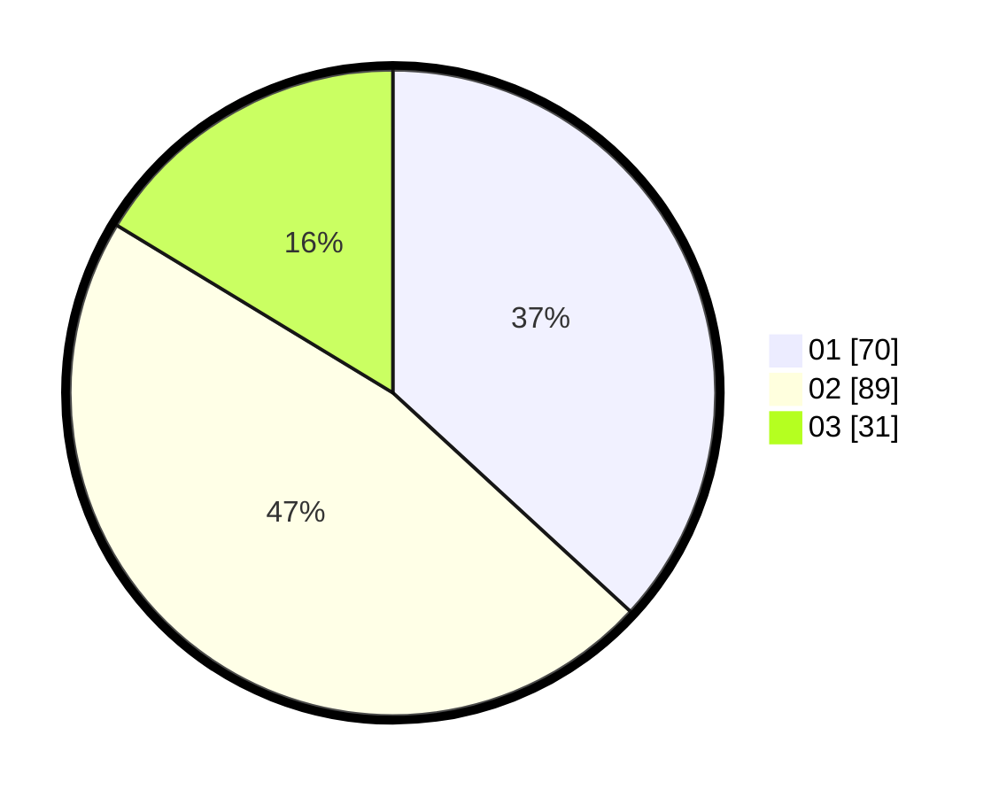

# Hasil

Hasil perolehan suara paslon dapat dilihat pada file paslon-01.txt, paslon-02.txt, dan paslon-03.txt.

Jika tidak ada, artinya data tersebut belum ada pada SIREKAP.

## Perolehan Suara

 * Paslon 01: **70**.
 * Paslon 02: **89**.
 * Paslon 03: **31**.

## Foto C Plano

https://sirekap-obj-formc.kpu.go.id/79bf/pemilu/ppwp/31/73/04/10/11/3173041011029-20240216-010517--4d469a14-79f1-411e-b9e4-b2669a9a5fc2.jpg

https://sirekap-obj-formc.kpu.go.id/79bf/pemilu/ppwp/31/73/04/10/11/3173041011029-20240217-064515--a5173cab-58c9-4014-a7e3-3e26364c021e.jpg

https://sirekap-obj-formc.kpu.go.id/79bf/pemilu/ppwp/31/73/04/10/11/3173041011029-20240217-064905--87479363-98ee-48f2-92e9-87d25a837300.jpg

## DATA PEMILIH TETAP

Jumlah pemilih dalam DPT: **242**.
 * L: **327**.
 * P: **728**.

## DATA PENGGUNA HAK PILIH

Jumlah pengguna hak pilih dalam DPT: **196**.
 * L: **208**.
 * P: **36**.

Jumlah pengguna hak pilih dalam DPTb: **0**.
 * L: **0**.
 * P: **0**.

Jumlah pengguna hak pilih dalam DPK: **1**.
 * L: **1**.
 * P: **8**.

Jumlah pengguna hak pilih: **237**.
 * L: **100**.
 * P: **96**.

## JUMLAH SUARA SAH DAN TIDAK SAH

JUMLAH SELURUH SUARA SAH: **190**.

JUMLAH SUARA TIDAK SAH: **7**.

JUMLAH SELURUH SUARA SAH DAN SUARA TIDAK SAH: **197**.
