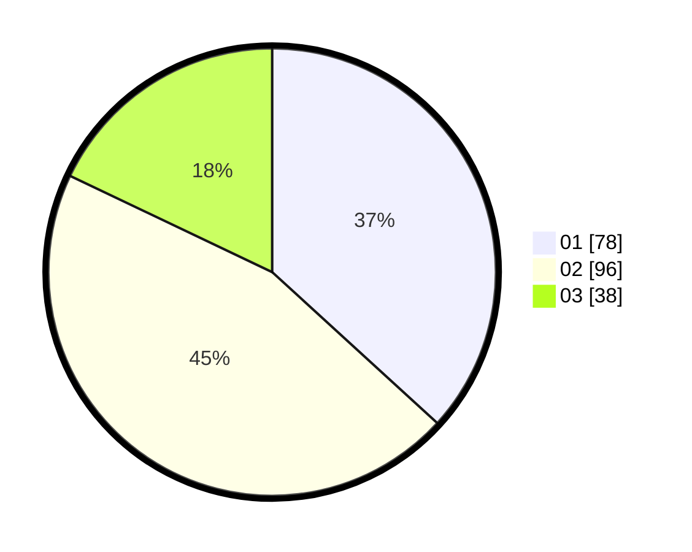

# Hasil

Hasil perolehan suara paslon dapat dilihat pada file paslon-01.txt, paslon-02.txt, dan paslon-03.txt.

Jika tidak ada, artinya data tersebut belum ada pada SIREKAP.

## Perolehan Suara

 * Paslon 01: **78**.
 * Paslon 02: **96**.
 * Paslon 03: **38**.

## Foto C Plano

https://sirekap-obj-formc.kpu.go.id/2580/pemilu/ppwp/31/73/04/10/11/3173041011030-20240215-202533--2f6eed3b-258e-4759-b5cd-60096d0f524e.jpg

https://sirekap-obj-formc.kpu.go.id/2580/pemilu/ppwp/31/73/04/10/11/3173041011030-20240215-202544--456714fe-872c-4c4f-acbe-ff287ff4982c.jpg

https://sirekap-obj-formc.kpu.go.id/2580/pemilu/ppwp/31/73/04/10/11/3173041011030-20240215-202537--f9511005-1f6f-4021-8cda-7d01aa7d32c4.jpg

## DATA PEMILIH TETAP

Jumlah pemilih dalam DPT: **269**.
 * L: **131**.
 * P: **138**.

## DATA PENGGUNA HAK PILIH

Jumlah pengguna hak pilih dalam DPT: **193**.
 * L: **94**.
 * P: **99**.

Jumlah pengguna hak pilih dalam DPTb: **16**.
 * L: **13**.
 * P: **3**.

Jumlah pengguna hak pilih dalam DPK: **5**.
 * L: **3**.
 * P: **2**.

Jumlah pengguna hak pilih: **214**.
 * L: **110**.
 * P: **104**.

## JUMLAH SUARA SAH DAN TIDAK SAH

JUMLAH SELURUH SUARA SAH: **212**.

JUMLAH SUARA TIDAK SAH: **2**.

JUMLAH SELURUH SUARA SAH DAN SUARA TIDAK SAH: **214**.
