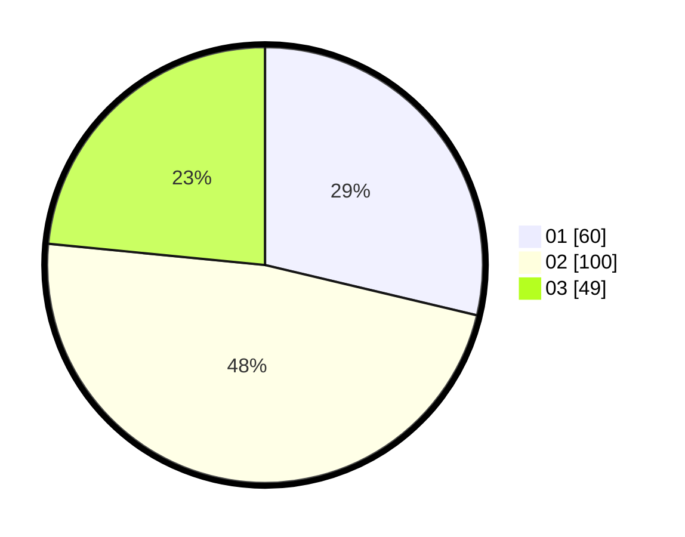

# Hasil

Hasil perolehan suara paslon dapat dilihat pada file paslon-01.txt, paslon-02.txt, dan paslon-03.txt.

Jika tidak ada, artinya data tersebut belum ada pada SIREKAP.

## Perolehan Suara

 * Paslon 01: **60**.
 * Paslon 02: **100**.
 * Paslon 03: **49**.

## Foto C Plano

https://sirekap-obj-formc.kpu.go.id/358b/pemilu/ppwp/31/73/04/10/11/3173041011033-20240214-232600--da40e3d2-2108-48ac-aa5c-7736e2ac0bab.jpg

https://sirekap-obj-formc.kpu.go.id/358b/pemilu/ppwp/31/73/04/10/11/3173041011033-20240214-221844--26900694-6ac4-4723-8009-28ec9c5ce9a0.jpg

https://sirekap-obj-formc.kpu.go.id/358b/pemilu/ppwp/31/73/04/10/11/3173041011033-20240214-221857--3ae63c2c-5133-4fbc-a413-990e3fa442cc.jpg
