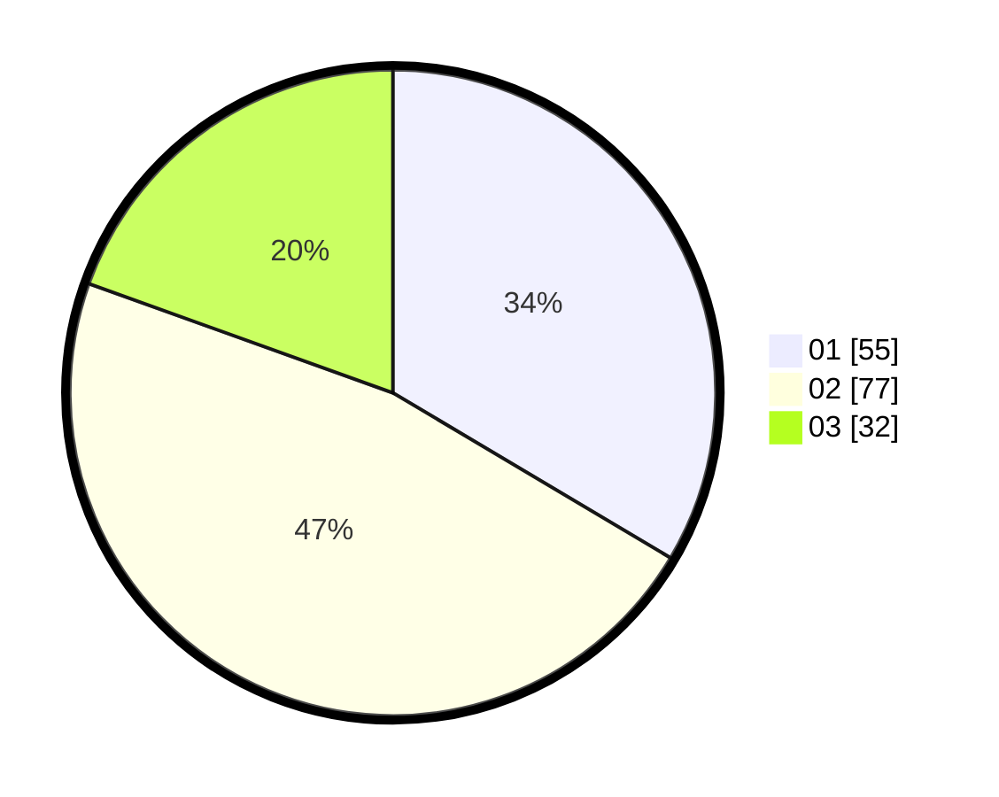

# Hasil

Hasil perolehan suara paslon dapat dilihat pada file paslon-01.txt, paslon-02.txt, dan paslon-03.txt.

Jika tidak ada, artinya data tersebut belum ada pada SIREKAP.

## Perolehan Suara

 * Paslon 01: **55**.
 * Paslon 02: **77**.
 * Paslon 03: **32**.

## Foto C Plano

https://sirekap-obj-formc.kpu.go.id/ba05/pemilu/ppwp/31/73/04/10/11/3173041011034-20240214-232730--3cb71148-185f-4821-bada-b1f0b22aff68.jpg

https://sirekap-obj-formc.kpu.go.id/ba05/pemilu/ppwp/31/73/04/10/11/3173041011034-20240214-211501--a76916d6-4218-4641-84cf-a8ad69cf7b1f.jpg

https://sirekap-obj-formc.kpu.go.id/ba05/pemilu/ppwp/31/73/04/10/11/3173041011034-20240214-233558--77947453-fac8-474e-8d99-838882880905.jpg
