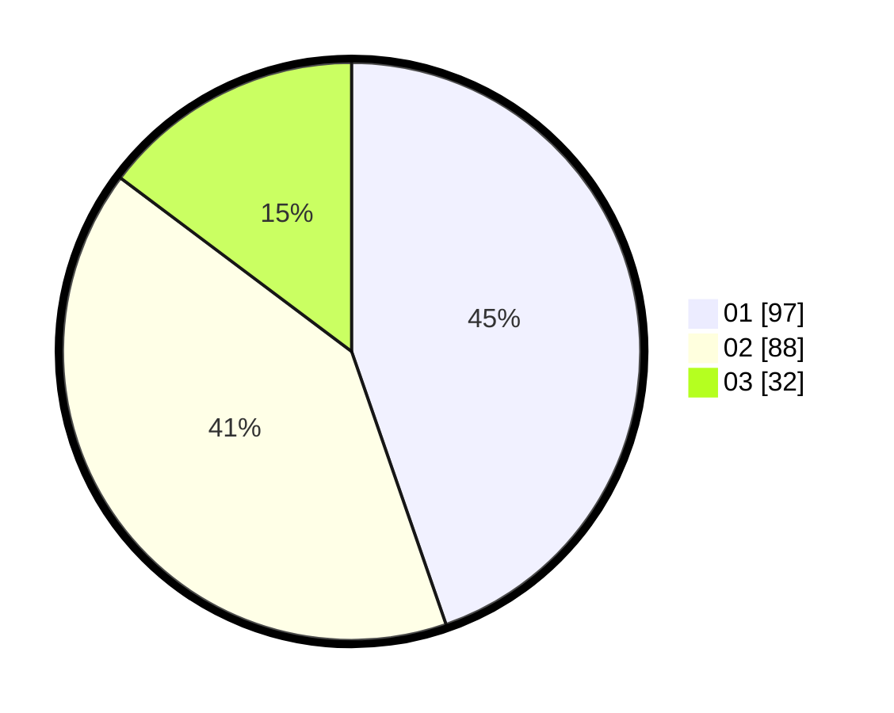

# Hasil

Hasil perolehan suara paslon dapat dilihat pada file paslon-01.txt, paslon-02.txt, dan paslon-03.txt.

Jika tidak ada, artinya data tersebut belum ada pada SIREKAP.

## Perolehan Suara

 * Paslon 01: **97**.
 * Paslon 02: **88**.
 * Paslon 03: **32**.

## Foto C Plano

https://sirekap-obj-formc.kpu.go.id/358e/pemilu/ppwp/31/73/04/10/11/3173041011037-20240215-012445--8e74dea6-8a49-458b-854a-63c4462aa719.jpg

https://sirekap-obj-formc.kpu.go.id/358e/pemilu/ppwp/31/73/04/10/11/3173041011037-20240215-012707--5b1c10d6-19e0-4439-861c-0f5efdc57d1d.jpg

https://sirekap-obj-formc.kpu.go.id/358e/pemilu/ppwp/31/73/04/10/11/3173041011037-20240215-012803--83427271-6726-4f30-97ae-171733d7f899.jpg
