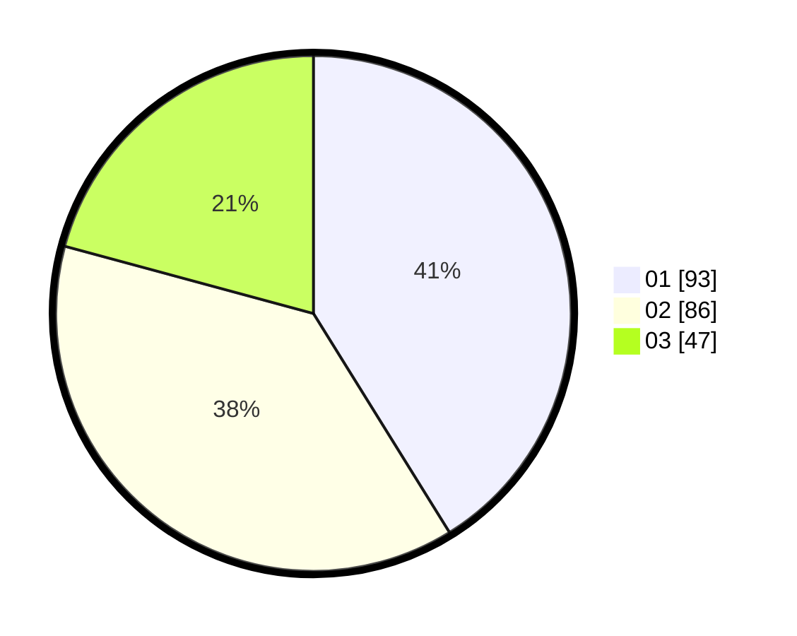

# Hasil

Hasil perolehan suara paslon dapat dilihat pada file paslon-01.txt, paslon-02.txt, dan paslon-03.txt.

Jika tidak ada, artinya data tersebut belum ada pada SIREKAP.

## Perolehan Suara

 * Paslon 01: **93**.
 * Paslon 02: **86**.
 * Paslon 03: **47**.

## Foto C Plano

https://sirekap-obj-formc.kpu.go.id/5882/pemilu/ppwp/31/73/04/10/11/3173041011040-20240214-194657--24fad28a-9641-45c6-8813-5ac6ab50616a.jpg

https://sirekap-obj-formc.kpu.go.id/5882/pemilu/ppwp/31/73/04/10/11/3173041011040-20240214-194723--43c32528-1717-4b2a-abdb-7a834995ff92.jpg

https://sirekap-obj-formc.kpu.go.id/5882/pemilu/ppwp/31/73/04/10/11/3173041011040-20240214-195036--3416ee76-e6fc-45eb-a02b-e930185fc074.jpg
