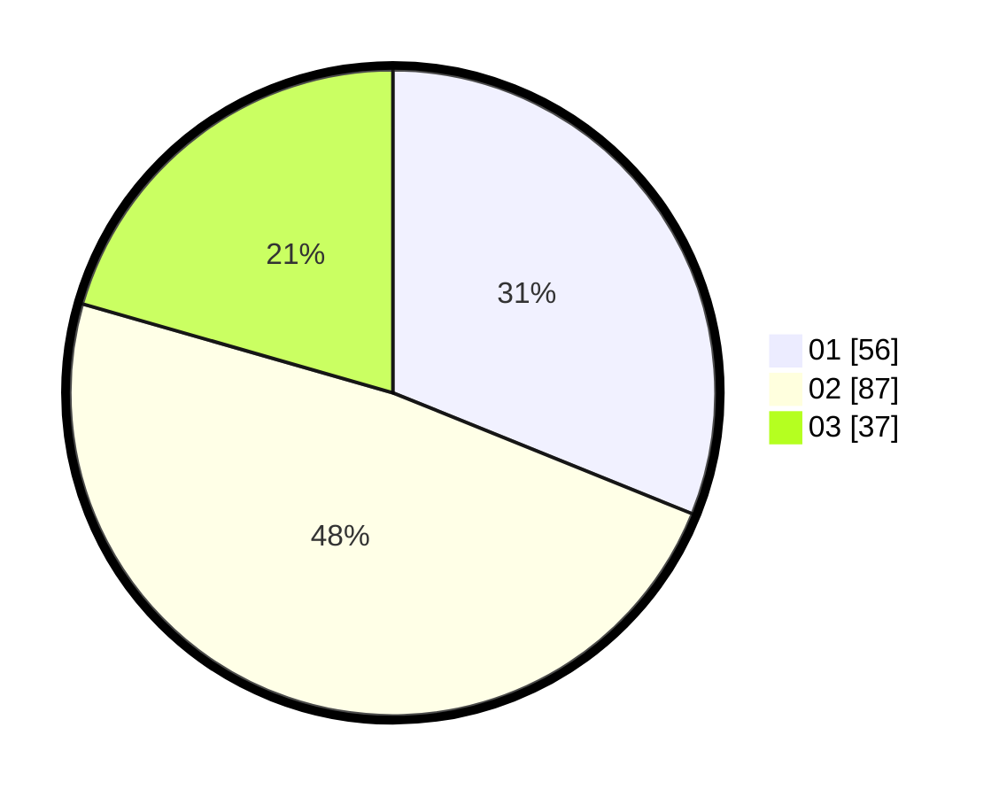

# Hasil

Hasil perolehan suara paslon dapat dilihat pada file paslon-01.txt, paslon-02.txt, dan paslon-03.txt.

Jika tidak ada, artinya data tersebut belum ada pada SIREKAP.

## Perolehan Suara

 * Paslon 01: **56**.
 * Paslon 02: **87**.
 * Paslon 03: **37**.

## Foto C Plano

https://sirekap-obj-formc.kpu.go.id/db4d/pemilu/ppwp/31/73/04/10/11/3173041011043-20240214-234716--b4c8335e-d5b0-44ae-83c6-08598fde2979.jpg

https://sirekap-obj-formc.kpu.go.id/db4d/pemilu/ppwp/31/73/04/10/11/3173041011043-20240214-234836--2b6a4565-d2eb-49ae-8692-81dc08db416d.jpg

https://sirekap-obj-formc.kpu.go.id/db4d/pemilu/ppwp/31/73/04/10/11/3173041011043-20240214-234949--d3586b89-fb26-42e9-9a6c-33395022fa1f.jpg
