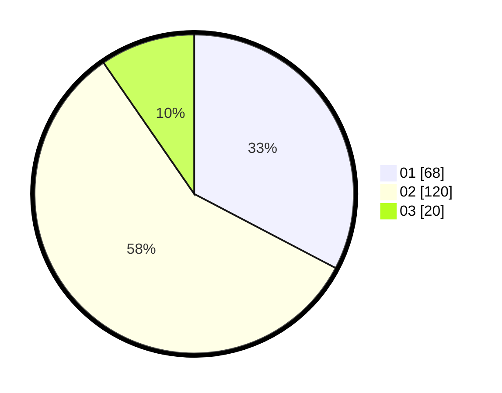

# Hasil

Hasil perolehan suara paslon dapat dilihat pada file paslon-01.txt, paslon-02.txt, dan paslon-03.txt.

Jika tidak ada, artinya data tersebut belum ada pada SIREKAP.

## Perolehan Suara

 * Paslon 01: **68**.
 * Paslon 02: **120**.
 * Paslon 03: **20**.

## Foto C Plano

https://sirekap-obj-formc.kpu.go.id/f8b6/pemilu/ppwp/31/73/04/10/11/3173041011045-20240214-213738--cbb3da98-a2c3-46e4-8a3b-d8ba78f29748.jpg

https://sirekap-obj-formc.kpu.go.id/f8b6/pemilu/ppwp/31/73/04/10/11/3173041011045-20240214-213947--4da141e0-07b9-426e-a57d-aedf4d94b267.jpg

https://sirekap-obj-formc.kpu.go.id/f8b6/pemilu/ppwp/31/73/04/10/11/3173041011045-20240214-214144--283f8f10-1bce-4ae0-acb4-7c541d1b7c20.jpg
