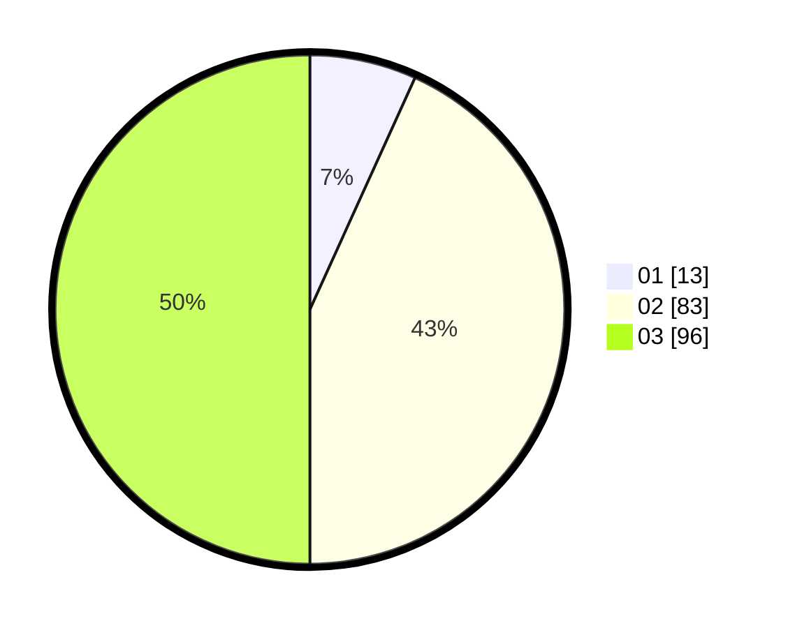

# Hasil

Hasil perolehan suara paslon dapat dilihat pada file paslon-01.txt, paslon-02.txt, dan paslon-03.txt.

Jika tidak ada, artinya data tersebut belum ada pada SIREKAP.

## Perolehan Suara

 * Paslon 01: **13**.
 * Paslon 02: **83**.
 * Paslon 03: **96**.

## Foto C Plano

https://sirekap-obj-formc.kpu.go.id/f93e/pemilu/ppwp/31/73/04/10/11/3173041011048-20240214-222041--31a08b46-8980-4d31-a633-b9383dc6acf4.jpg

https://sirekap-obj-formc.kpu.go.id/f93e/pemilu/ppwp/31/73/04/10/11/3173041011048-20240214-222137--ca4dbf13-883b-491e-8f50-db673de40e5e.jpg

https://sirekap-obj-formc.kpu.go.id/f93e/pemilu/ppwp/31/73/04/10/11/3173041011048-20240214-222239--47e7a268-aa57-4d49-93b9-e29fcd01eeba.jpg
