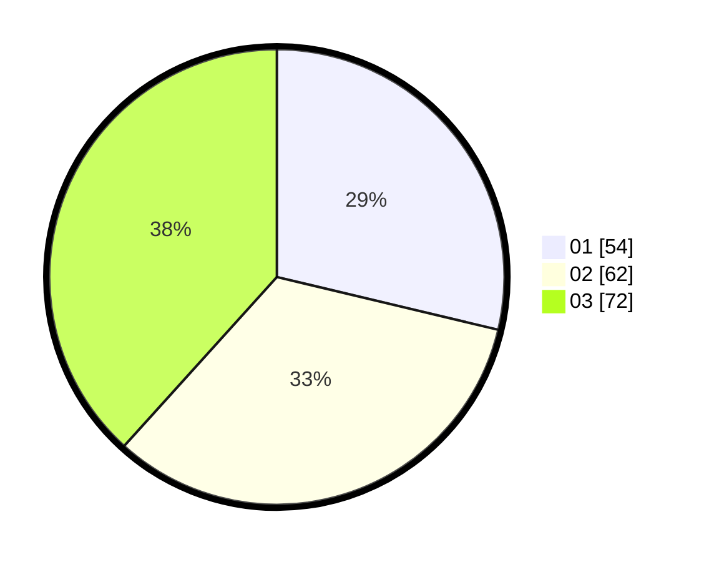

# Hasil

Hasil perolehan suara paslon dapat dilihat pada file paslon-01.txt, paslon-02.txt, dan paslon-03.txt.

Jika tidak ada, artinya data tersebut belum ada pada SIREKAP.

## Perolehan Suara

 * Paslon 01: **54**.
 * Paslon 02: **62**.
 * Paslon 03: **72**.

## Foto C Plano

https://sirekap-obj-formc.kpu.go.id/85ff/pemilu/ppwp/31/73/04/10/11/3173041011049-20240214-193246--ad3f0eb8-a210-4fc0-873f-f59c7528e3d3.jpg

https://sirekap-obj-formc.kpu.go.id/85ff/pemilu/ppwp/31/73/04/10/11/3173041011049-20240214-192256--80aa1877-d869-48bd-8f7d-30d18921ce7e.jpg

https://sirekap-obj-formc.kpu.go.id/85ff/pemilu/ppwp/31/73/04/10/11/3173041011049-20240214-192925--b5830c52-d2b9-46fb-949c-8699c0aa3a2b.jpg
