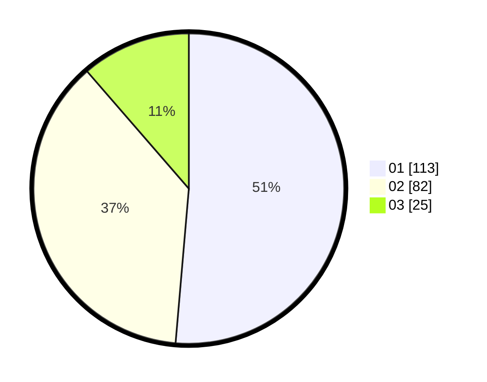

# Hasil

Hasil perolehan suara paslon dapat dilihat pada file paslon-01.txt, paslon-02.txt, dan paslon-03.txt.

Jika tidak ada, artinya data tersebut belum ada pada SIREKAP.

## Perolehan Suara

 * Paslon 01: **113**.
 * Paslon 02: **82**.
 * Paslon 03: **25**.

## Foto C Plano

https://sirekap-obj-formc.kpu.go.id/59e4/pemilu/ppwp/31/73/05/10/01/3173051001001-20240214-205319--7dec8707-2915-4cf5-adb9-aa717e602dfb.jpg

https://sirekap-obj-formc.kpu.go.id/59e4/pemilu/ppwp/31/73/05/10/01/3173051001001-20240214-205452--d58d84e8-6549-40f6-8718-54aabcd24d2d.jpg

https://sirekap-obj-formc.kpu.go.id/59e4/pemilu/ppwp/31/73/05/10/01/3173051001001-20240214-215557--bc2f7d56-e26e-45d1-a642-9cf276c68fce.jpg

## DATA PEMILIH TETAP

Jumlah pemilih dalam DPT: **283**.
 * L: **131**.
 * P: **152**.

## DATA PENGGUNA HAK PILIH

Jumlah pengguna hak pilih dalam DPT: **215**.
 * L: **95**.
 * P: **120**.

Jumlah pengguna hak pilih dalam DPTb: **6**.
 * L: **3**.
 * P: **3**.

Jumlah pengguna hak pilih dalam DPK: **3**.
 * L: **2**.
 * P: **1**.

Jumlah pengguna hak pilih: **224**.
 * L: **100**.
 * P: **124**.

## JUMLAH SUARA SAH DAN TIDAK SAH

JUMLAH SELURUH SUARA SAH: **220**.

JUMLAH SUARA TIDAK SAH: **4**.

JUMLAH SELURUH SUARA SAH DAN SUARA TIDAK SAH: **224**.
