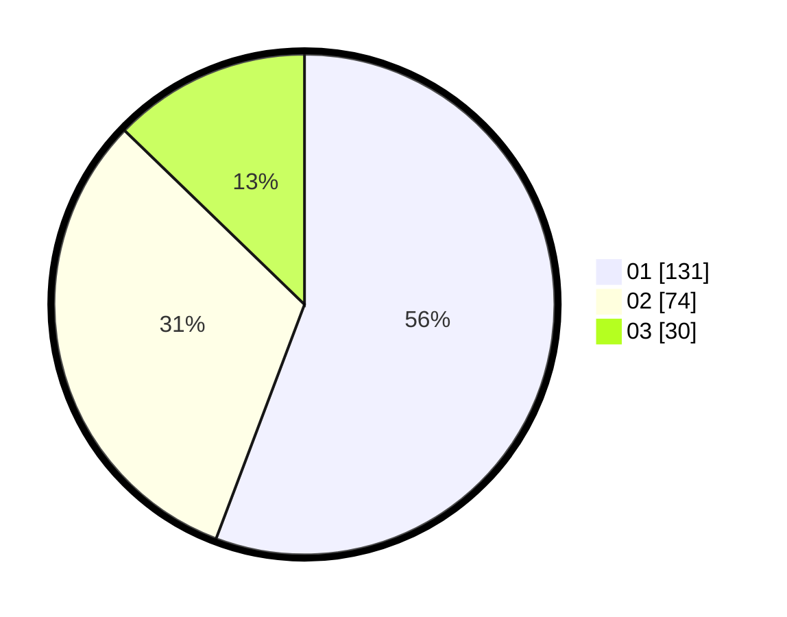

# Hasil

Hasil perolehan suara paslon dapat dilihat pada file paslon-01.txt, paslon-02.txt, dan paslon-03.txt.

Jika tidak ada, artinya data tersebut belum ada pada SIREKAP.

## Perolehan Suara

 * Paslon 01: **131**.
 * Paslon 02: **74**.
 * Paslon 03: **30**.

## Foto C Plano

https://sirekap-obj-formc.kpu.go.id/dc0b/pemilu/ppwp/31/73/05/10/01/3173051001006-20240214-190909--0e86363a-2bce-43d8-aa14-ee575a29ef37.jpg

https://sirekap-obj-formc.kpu.go.id/dc0b/pemilu/ppwp/31/73/05/10/01/3173051001006-20240214-191502--fb44172b-c5e2-4f7c-bf8e-1040f391791f.jpg

https://sirekap-obj-formc.kpu.go.id/dc0b/pemilu/ppwp/31/73/05/10/01/3173051001006-20240214-191511--36700e9c-23c8-4243-b798-e64e31c0dfcd.jpg

## DATA PEMILIH TETAP

Jumlah pemilih dalam DPT: **273**.
 * L: **129**.
 * P: **144**.

## DATA PENGGUNA HAK PILIH

Jumlah pengguna hak pilih dalam DPT: **223**.
 * L: **103**.
 * P: **120**.

Jumlah pengguna hak pilih dalam DPTb: **12**.
 * L: **7**.
 * P: **5**.

Jumlah pengguna hak pilih dalam DPK: **1**.
 * L: **1**.
 * P: **0**.

Jumlah pengguna hak pilih: **236**.
 * L: **111**.
 * P: **125**.

## JUMLAH SUARA SAH DAN TIDAK SAH

JUMLAH SELURUH SUARA SAH: **235**.

JUMLAH SUARA TIDAK SAH: **1**.

JUMLAH SELURUH SUARA SAH DAN SUARA TIDAK SAH: **236**.
