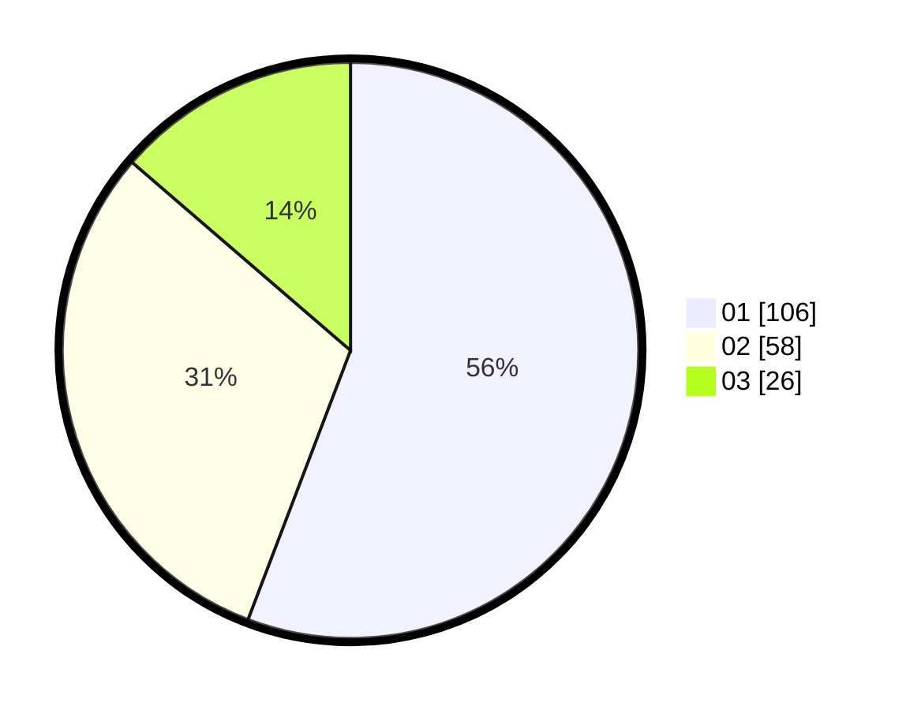

# Hasil

Hasil perolehan suara paslon dapat dilihat pada file paslon-01.txt, paslon-02.txt, dan paslon-03.txt.

Jika tidak ada, artinya data tersebut belum ada pada SIREKAP.

## Perolehan Suara

 * Paslon 01: **106**.
 * Paslon 02: **58**.
 * Paslon 03: **26**.

## Foto C Plano

https://sirekap-obj-formc.kpu.go.id/1aa4/pemilu/ppwp/31/73/05/10/01/3173051001012-20240215-000811--c9b8b52e-bb16-4e19-9963-76ac0b1833ad.jpg

https://sirekap-obj-formc.kpu.go.id/1aa4/pemilu/ppwp/31/73/05/10/01/3173051001012-20240214-234940--78b19c72-4428-4e41-a609-4212ad19e0a1.jpg

https://sirekap-obj-formc.kpu.go.id/1aa4/pemilu/ppwp/31/73/05/10/01/3173051001012-20240214-235042--8910d9ff-2b9c-4e90-bead-a86a521843d5.jpg
