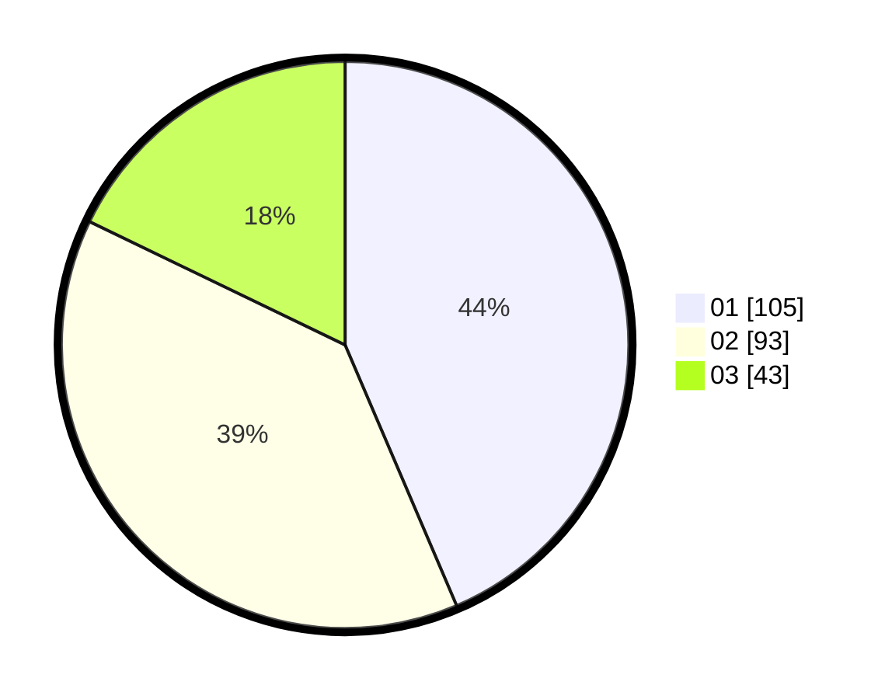

# Hasil

Hasil perolehan suara paslon dapat dilihat pada file paslon-01.txt, paslon-02.txt, dan paslon-03.txt.

Jika tidak ada, artinya data tersebut belum ada pada SIREKAP.

## Perolehan Suara

 * Paslon 01: **105**.
 * Paslon 02: **93**.
 * Paslon 03: **43**.

## Foto C Plano

https://sirekap-obj-formc.kpu.go.id/3399/pemilu/ppwp/31/73/05/10/01/3173051001020-20240214-195902--36ee036b-282a-4855-84b6-8d3d32d124f2.jpg

https://sirekap-obj-formc.kpu.go.id/3399/pemilu/ppwp/31/73/05/10/01/3173051001020-20240214-200349--1262c93b-8f1e-44fd-91b3-be90ebf98d4a.jpg

https://sirekap-obj-formc.kpu.go.id/3399/pemilu/ppwp/31/73/05/10/01/3173051001020-20240214-200611--6dcebb77-4aac-44fe-ba9d-5fc6e27ad4eb.jpg
