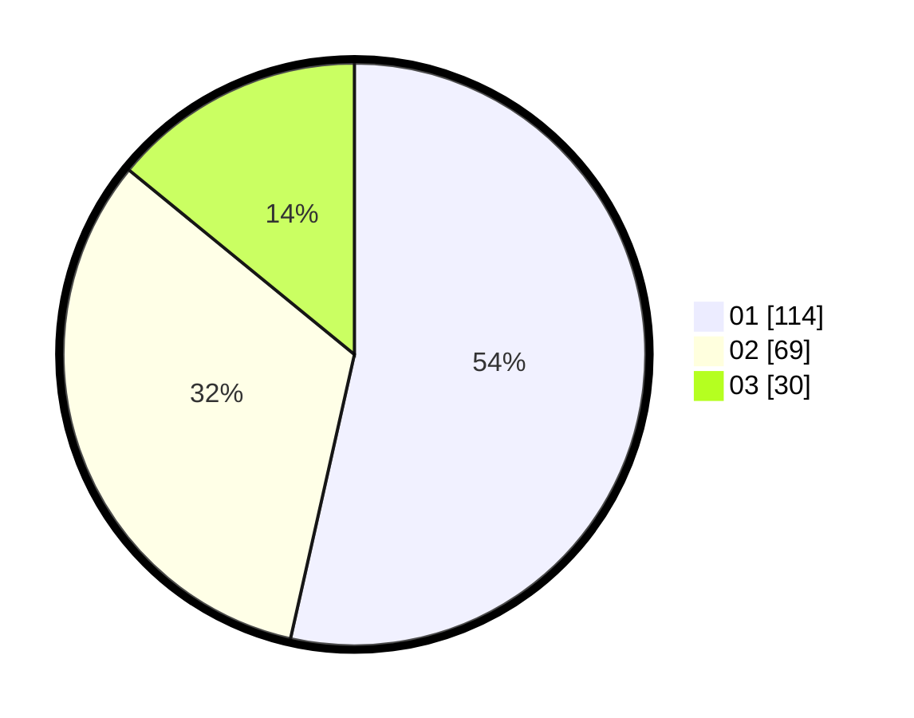

# Hasil

Hasil perolehan suara paslon dapat dilihat pada file paslon-01.txt, paslon-02.txt, dan paslon-03.txt.

Jika tidak ada, artinya data tersebut belum ada pada SIREKAP.

## Perolehan Suara

 * Paslon 01: **114**.
 * Paslon 02: **69**.
 * Paslon 03: **30**.

## Foto C Plano

https://sirekap-obj-formc.kpu.go.id/a860/pemilu/ppwp/31/73/05/10/01/3173051001022-20240214-194657--065fdceb-b3c3-4e30-ba4a-fd9fb800644d.jpg

https://sirekap-obj-formc.kpu.go.id/a860/pemilu/ppwp/31/73/05/10/01/3173051001022-20240214-233942--309718f1-0e45-4e0a-a7e5-5be0876d575d.jpg

https://sirekap-obj-formc.kpu.go.id/a860/pemilu/ppwp/31/73/05/10/01/3173051001022-20240214-234056--c572eacb-9c53-499b-9150-5f90cdef50ff.jpg

## DATA PEMILIH TETAP

Jumlah pemilih dalam DPT: **293**.
 * L: **151**.
 * P: **142**.

## DATA PENGGUNA HAK PILIH

Jumlah pengguna hak pilih dalam DPT: **212**.
 * L: **102**.
 * P: **110**.

Jumlah pengguna hak pilih dalam DPTb: **2**.
 * L: **1**.
 * P: **1**.

Jumlah pengguna hak pilih dalam DPK: **0**.
 * L: **0**.
 * P: **0**.

Jumlah pengguna hak pilih: **214**.
 * L: **103**.
 * P: **111**.

## JUMLAH SUARA SAH DAN TIDAK SAH

JUMLAH SELURUH SUARA SAH: **213**.

JUMLAH SUARA TIDAK SAH: **1**.

JUMLAH SELURUH SUARA SAH DAN SUARA TIDAK SAH: **214**.
