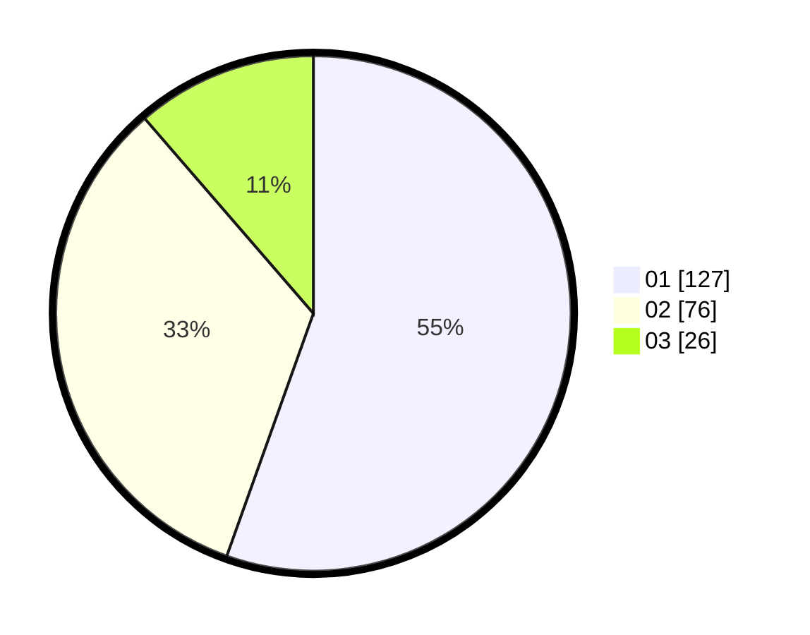

# Hasil

Hasil perolehan suara paslon dapat dilihat pada file paslon-01.txt, paslon-02.txt, dan paslon-03.txt.

Jika tidak ada, artinya data tersebut belum ada pada SIREKAP.

## Perolehan Suara

 * Paslon 01: **127**.
 * Paslon 02: **76**.
 * Paslon 03: **26**.

## Foto C Plano

https://sirekap-obj-formc.kpu.go.id/ad26/pemilu/ppwp/31/73/05/10/01/3173051001024-20240214-221528--9d5952c4-9cab-4246-8a5c-130588bc767d.jpg

https://sirekap-obj-formc.kpu.go.id/ad26/pemilu/ppwp/31/73/05/10/01/3173051001024-20240214-221330--4b27a951-04c3-4116-a068-7021fccf0d9b.jpg
