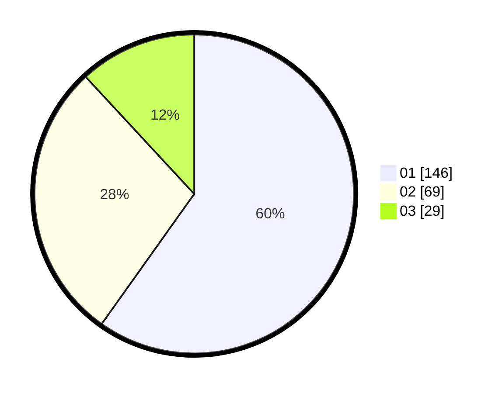

# Hasil

Hasil perolehan suara paslon dapat dilihat pada file paslon-01.txt, paslon-02.txt, dan paslon-03.txt.

Jika tidak ada, artinya data tersebut belum ada pada SIREKAP.

## Perolehan Suara

 * Paslon 01: **146**.
 * Paslon 02: **69**.
 * Paslon 03: **29**.

## Foto C Plano

https://sirekap-obj-formc.kpu.go.id/9173/pemilu/ppwp/31/73/05/10/01/3173051001030-20240216-042121--6297c3ff-d56d-4532-9075-5c2c3fad4540.jpg

https://sirekap-obj-formc.kpu.go.id/9173/pemilu/ppwp/31/73/05/10/01/3173051001030-20240216-042123--010b281d-5193-4339-b1ff-01952eabe753.jpg

https://sirekap-obj-formc.kpu.go.id/9173/pemilu/ppwp/31/73/05/10/01/3173051001030-20240216-042122--60ba4bf9-4a5b-41fc-982c-2c402a86d2af.jpg

## DATA PEMILIH TETAP

Jumlah pemilih dalam DPT: **292**.
 * L: **131**.
 * P: **161**.

## DATA PENGGUNA HAK PILIH

Jumlah pengguna hak pilih dalam DPT: **240**.
 * L: **106**.
 * P: **134**.

Jumlah pengguna hak pilih dalam DPTb: **8**.
 * L: **3**.
 * P: **5**.

Jumlah pengguna hak pilih dalam DPK: **2**.
 * L: **1**.
 * P: **1**.

Jumlah pengguna hak pilih: **250**.
 * L: **110**.
 * P: **140**.

## JUMLAH SUARA SAH DAN TIDAK SAH

JUMLAH SELURUH SUARA SAH: **244**.

JUMLAH SUARA TIDAK SAH: **6**.

JUMLAH SELURUH SUARA SAH DAN SUARA TIDAK SAH: **250**.
