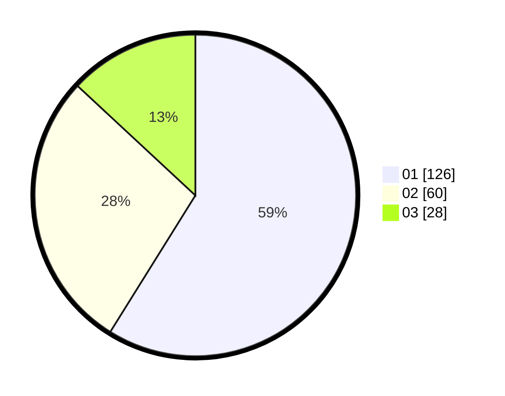

# Hasil

Hasil perolehan suara paslon dapat dilihat pada file paslon-01.txt, paslon-02.txt, dan paslon-03.txt.

Jika tidak ada, artinya data tersebut belum ada pada SIREKAP.

## Perolehan Suara

 * Paslon 01: **126**.
 * Paslon 02: **60**.
 * Paslon 03: **28**.

## Foto C Plano

https://sirekap-obj-formc.kpu.go.id/6254/pemilu/ppwp/31/73/05/10/01/3173051001032-20240214-211334--1414154d-6076-48e0-9fff-d585b0955e84.jpg

https://sirekap-obj-formc.kpu.go.id/6254/pemilu/ppwp/31/73/05/10/01/3173051001032-20240214-221942--df90fc06-14d0-48bb-8862-621ceb0c85c0.jpg

https://sirekap-obj-formc.kpu.go.id/6254/pemilu/ppwp/31/73/05/10/01/3173051001032-20240214-211415--e2fee9b8-6aa3-45ac-8344-6d8d36a9198f.jpg
