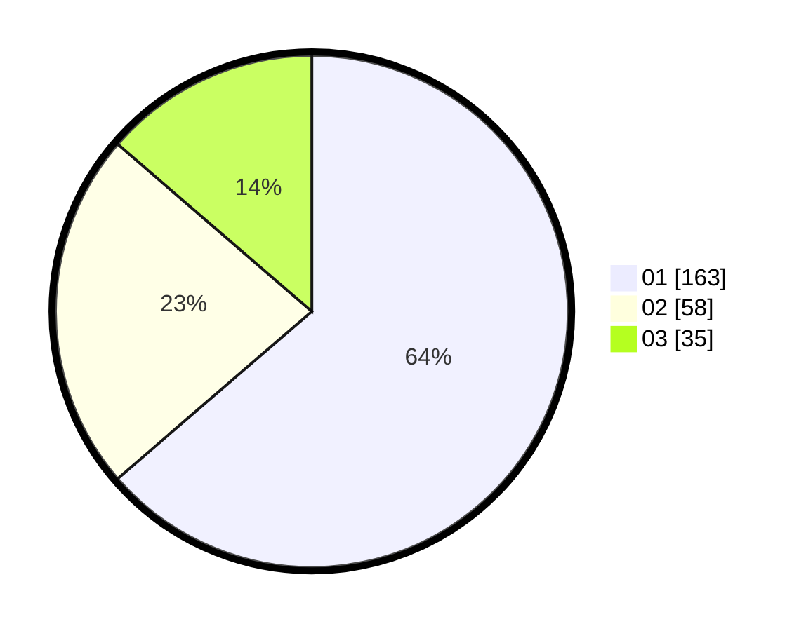

# Hasil

Hasil perolehan suara paslon dapat dilihat pada file paslon-01.txt, paslon-02.txt, dan paslon-03.txt.

Jika tidak ada, artinya data tersebut belum ada pada SIREKAP.

## Perolehan Suara

 * Paslon 01: **163**.
 * Paslon 02: **58**.
 * Paslon 03: **35**.

## Foto C Plano

https://sirekap-obj-formc.kpu.go.id/ffb4/pemilu/ppwp/31/73/05/10/01/3173051001033-20240215-032315--0858a7af-7ac3-4005-be02-f01cfea479b1.jpg

https://sirekap-obj-formc.kpu.go.id/ffb4/pemilu/ppwp/31/73/05/10/01/3173051001033-20240215-032616--364f80db-7742-4c92-a6d5-a26981ca0f07.jpg

https://sirekap-obj-formc.kpu.go.id/ffb4/pemilu/ppwp/31/73/05/10/01/3173051001033-20240215-032903--f405b321-bbec-498a-a5b7-bee888a7d7c4.jpg
