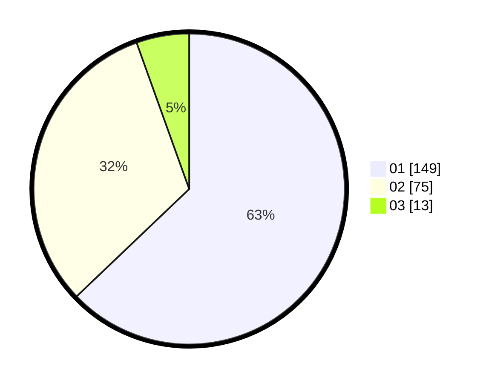

# Hasil

Hasil perolehan suara paslon dapat dilihat pada file paslon-01.txt, paslon-02.txt, dan paslon-03.txt.

Jika tidak ada, artinya data tersebut belum ada pada SIREKAP.

## Perolehan Suara

 * Paslon 01: **149**.
 * Paslon 02: **75**.
 * Paslon 03: **13**.

## Foto C Plano

https://sirekap-obj-formc.kpu.go.id/a73f/pemilu/ppwp/31/73/05/10/01/3173051001034-20240215-035400--3e6e91db-a0b1-468b-9abd-cc363d53346a.jpg

https://sirekap-obj-formc.kpu.go.id/a73f/pemilu/ppwp/31/73/05/10/01/3173051001034-20240215-030624--ac4869e9-8a62-49d2-970b-4b0ef31a2a06.jpg

https://sirekap-obj-formc.kpu.go.id/a73f/pemilu/ppwp/31/73/05/10/01/3173051001034-20240215-031310--3a501bb1-4ed6-4a56-ab21-3dfc4ec8aaa4.jpg
