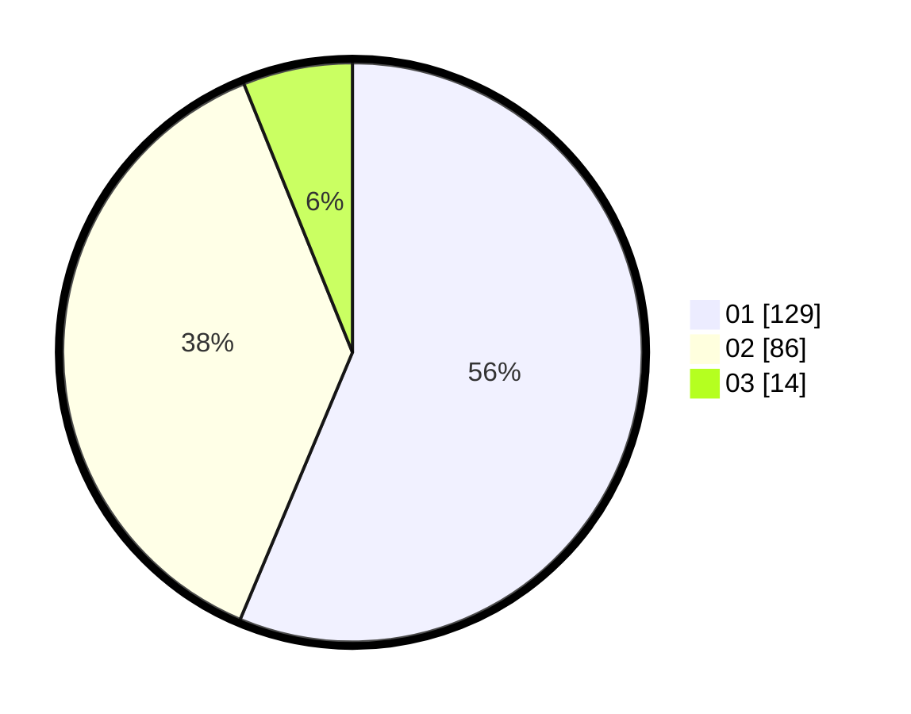

# Hasil

Hasil perolehan suara paslon dapat dilihat pada file paslon-01.txt, paslon-02.txt, dan paslon-03.txt.

Jika tidak ada, artinya data tersebut belum ada pada SIREKAP.

## Perolehan Suara

 * Paslon 01: **129**.
 * Paslon 02: **86**.
 * Paslon 03: **14**.

## Foto C Plano

https://sirekap-obj-formc.kpu.go.id/b64b/pemilu/ppwp/31/73/05/10/01/3173051001035-20240215-021803--f229754c-cb03-4b6a-a6c6-b901df1560a9.jpg

https://sirekap-obj-formc.kpu.go.id/b64b/pemilu/ppwp/31/73/05/10/01/3173051001035-20240215-021851--6a745ac9-beab-48e5-a2ce-98d0f2d70198.jpg

https://sirekap-obj-formc.kpu.go.id/b64b/pemilu/ppwp/31/73/05/10/01/3173051001035-20240215-021633--aa2108ed-100d-4caf-b08c-92c99c042d13.jpg

## DATA PEMILIH TETAP

Jumlah pemilih dalam DPT: **265**.
 * L: **128**.
 * P: **137**.

## DATA PENGGUNA HAK PILIH

Jumlah pengguna hak pilih dalam DPT: **224**.
 * L: **104**.
 * P: **120**.

Jumlah pengguna hak pilih dalam DPTb: **2**.
 * L: **2**.
 * P: **0**.

Jumlah pengguna hak pilih dalam DPK: **4**.
 * L: **3**.
 * P: **1**.

Jumlah pengguna hak pilih: **230**.
 * L: **109**.
 * P: **121**.

## JUMLAH SUARA SAH DAN TIDAK SAH

JUMLAH SELURUH SUARA SAH: **229**.

JUMLAH SUARA TIDAK SAH: **1**.

JUMLAH SELURUH SUARA SAH DAN SUARA TIDAK SAH: **230**.
