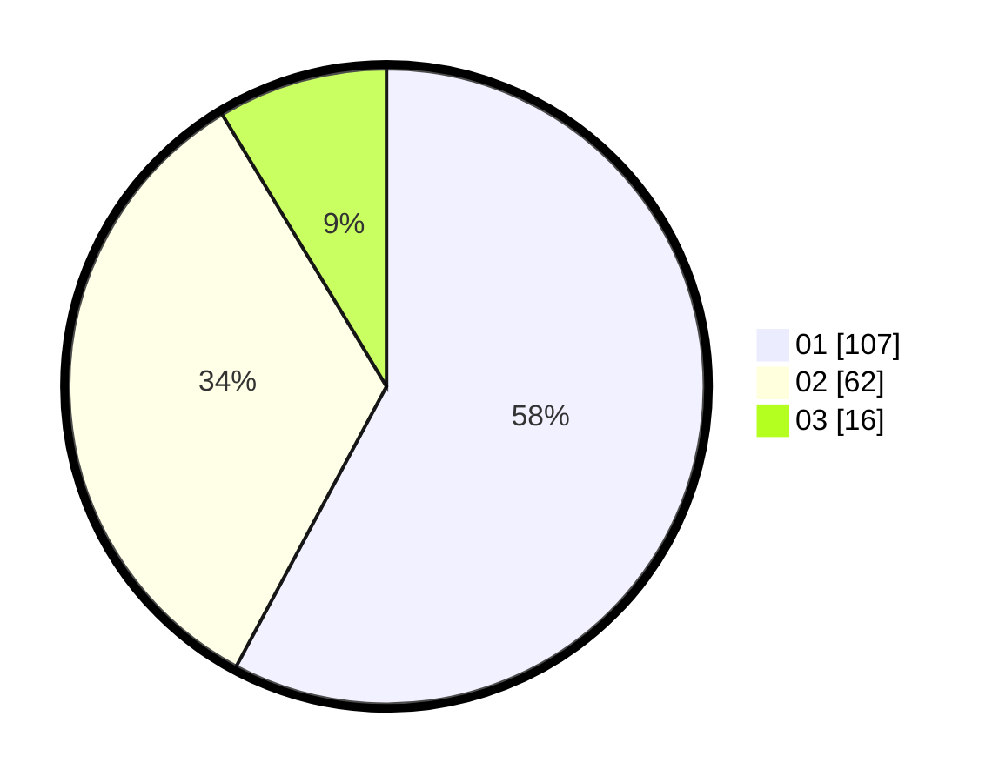

# Hasil

Hasil perolehan suara paslon dapat dilihat pada file paslon-01.txt, paslon-02.txt, dan paslon-03.txt.

Jika tidak ada, artinya data tersebut belum ada pada SIREKAP.

## Perolehan Suara

 * Paslon 01: **107**.
 * Paslon 02: **62**.
 * Paslon 03: **16**.

## Foto C Plano

https://sirekap-obj-formc.kpu.go.id/4ae4/pemilu/ppwp/31/73/05/10/01/3173051001036-20240215-015825--604e7e2b-3701-4a5b-bba4-3aa70620235e.jpg

https://sirekap-obj-formc.kpu.go.id/4ae4/pemilu/ppwp/31/73/05/10/01/3173051001036-20240215-021022--af55c97e-e580-49e6-8b1f-bd4dbff54d42.jpg

https://sirekap-obj-formc.kpu.go.id/4ae4/pemilu/ppwp/31/73/05/10/01/3173051001036-20240215-022749--341fa1ba-8fdb-4457-ae43-81d68c72c730.jpg

## DATA PEMILIH TETAP

Jumlah pemilih dalam DPT: **232**.
 * L: **108**.
 * P: **124**.

## DATA PENGGUNA HAK PILIH

Jumlah pengguna hak pilih dalam DPT: **184**.
 * L: **84**.
 * P: **100**.

Jumlah pengguna hak pilih dalam DPTb: **3**.
 * L: **1**.
 * P: **2**.

Jumlah pengguna hak pilih dalam DPK: **1**.
 * L: **1**.
 * P: **0**.

Jumlah pengguna hak pilih: **188**.
 * L: **86**.
 * P: **102**.

## JUMLAH SUARA SAH DAN TIDAK SAH

JUMLAH SELURUH SUARA SAH: **185**.

JUMLAH SUARA TIDAK SAH: **3**.

JUMLAH SELURUH SUARA SAH DAN SUARA TIDAK SAH: **188**.
