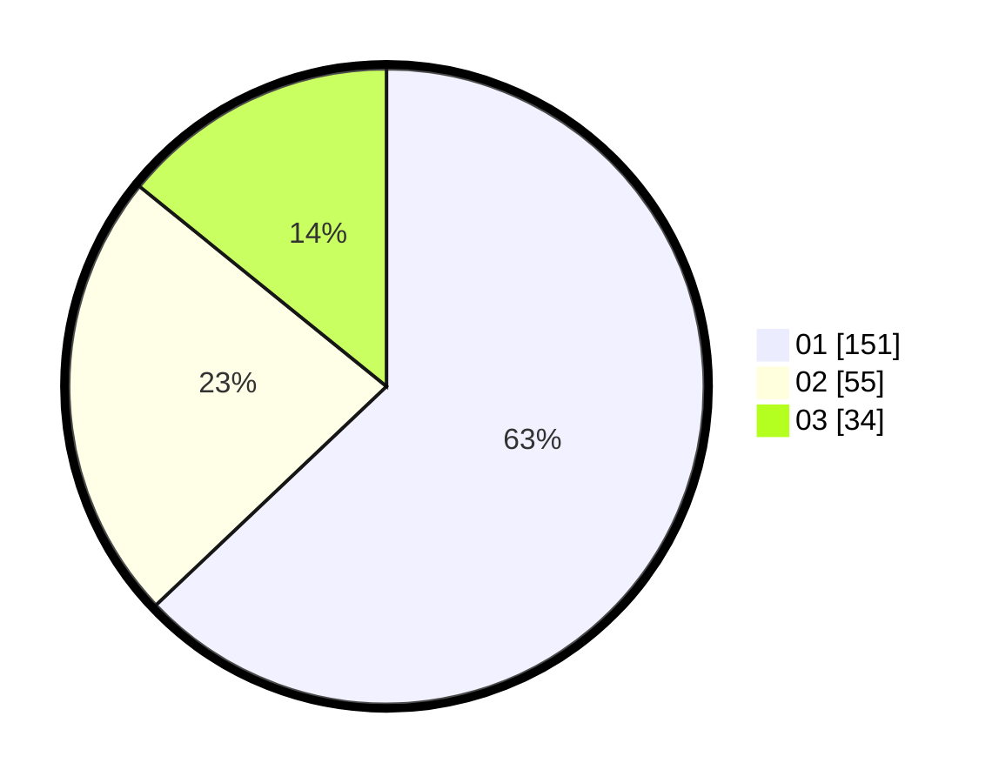

# Hasil

Hasil perolehan suara paslon dapat dilihat pada file paslon-01.txt, paslon-02.txt, dan paslon-03.txt.

Jika tidak ada, artinya data tersebut belum ada pada SIREKAP.

## Perolehan Suara

 * Paslon 01: **151**.
 * Paslon 02: **55**.
 * Paslon 03: **34**.

## Foto C Plano

https://sirekap-obj-formc.kpu.go.id/a058/pemilu/ppwp/31/73/05/10/01/3173051001040-20240216-134843--49aa0d0d-8730-443c-af6d-49c358ebf542.jpg

https://sirekap-obj-formc.kpu.go.id/a058/pemilu/ppwp/31/73/05/10/01/3173051001040-20240216-134820--4c089778-68e2-47ce-ac86-ed6d55440b97.jpg

https://sirekap-obj-formc.kpu.go.id/a058/pemilu/ppwp/31/73/05/10/01/3173051001040-20240216-135036--79022cc3-ba74-4cbf-8511-48e0559c2462.jpg
