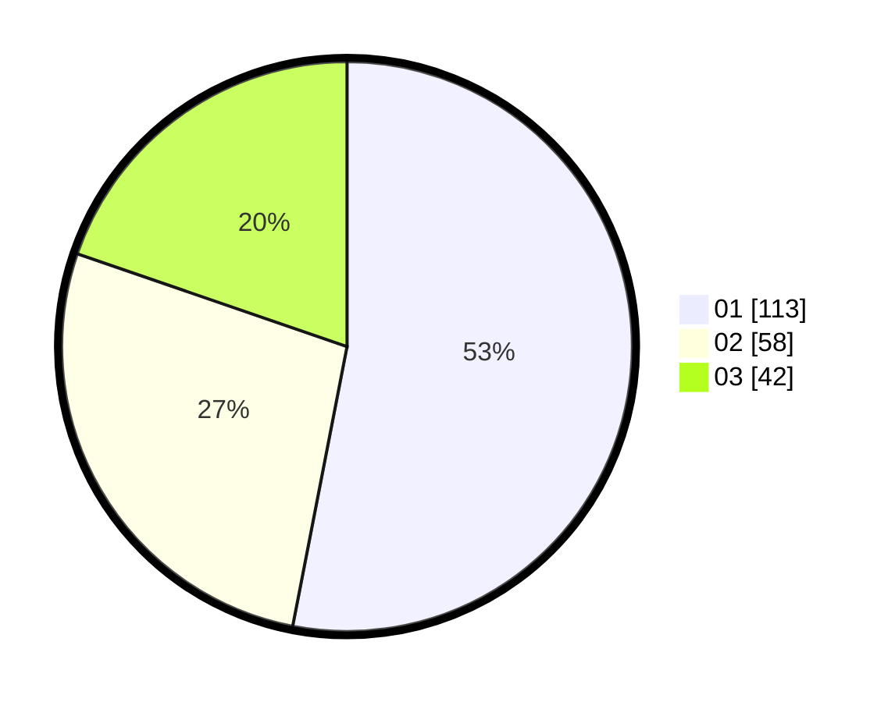

# Hasil

Hasil perolehan suara paslon dapat dilihat pada file paslon-01.txt, paslon-02.txt, dan paslon-03.txt.

Jika tidak ada, artinya data tersebut belum ada pada SIREKAP.

## Perolehan Suara

 * Paslon 01: **113**.
 * Paslon 02: **58**.
 * Paslon 03: **42**.

## Foto C Plano

https://sirekap-obj-formc.kpu.go.id/1a27/pemilu/ppwp/31/73/05/10/01/3173051001042-20240214-224942--b07cacf7-6907-4749-8563-c9f56d71c923.jpg

https://sirekap-obj-formc.kpu.go.id/1a27/pemilu/ppwp/31/73/05/10/01/3173051001042-20240214-230043--b7655879-40d0-4700-afc7-75a86b6b6d3c.jpg

https://sirekap-obj-formc.kpu.go.id/1a27/pemilu/ppwp/31/73/05/10/01/3173051001042-20240214-230231--4717b533-03d7-4f1b-8bc2-0f7cb600fdae.jpg
