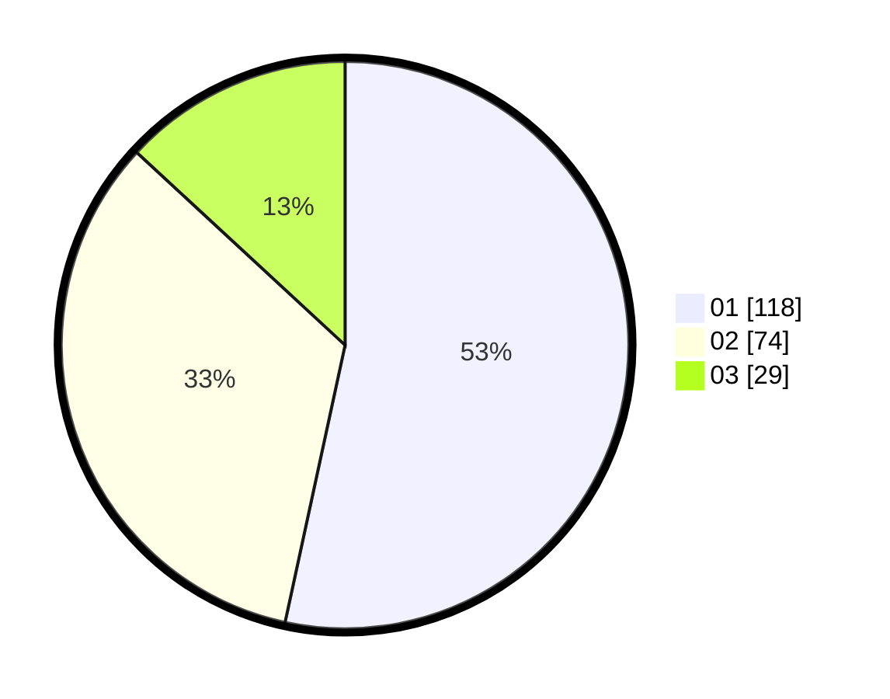

# Hasil

Hasil perolehan suara paslon dapat dilihat pada file paslon-01.txt, paslon-02.txt, dan paslon-03.txt.

Jika tidak ada, artinya data tersebut belum ada pada SIREKAP.

## Perolehan Suara

 * Paslon 01: **118**.
 * Paslon 02: **74**.
 * Paslon 03: **29**.

## Foto C Plano

https://sirekap-obj-formc.kpu.go.id/b2e9/pemilu/ppwp/31/73/05/10/01/3173051001044-20240214-234129--8cdef782-e639-4b04-88be-546388c93783.jpg

https://sirekap-obj-formc.kpu.go.id/b2e9/pemilu/ppwp/31/73/05/10/01/3173051001044-20240214-232340--35393ea7-4b29-4203-a034-c0609c65c720.jpg

https://sirekap-obj-formc.kpu.go.id/b2e9/pemilu/ppwp/31/73/05/10/01/3173051001044-20240214-234348--356653f0-6067-4bcc-8c46-b969fdc93a90.jpg
