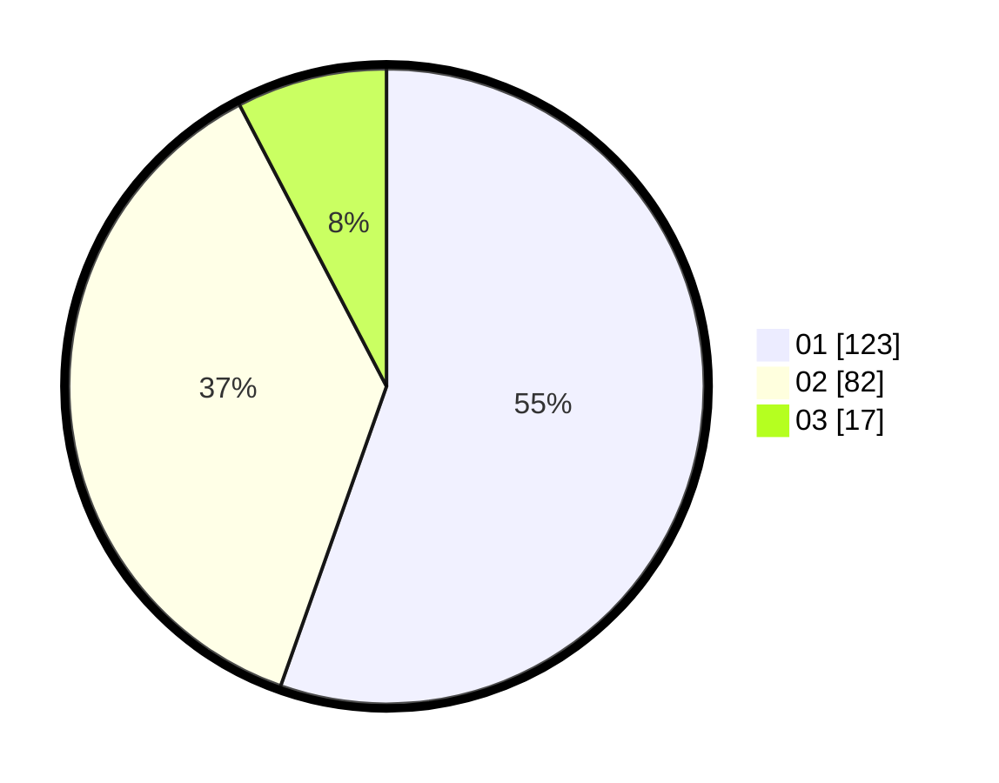

# Hasil

Hasil perolehan suara paslon dapat dilihat pada file paslon-01.txt, paslon-02.txt, dan paslon-03.txt.

Jika tidak ada, artinya data tersebut belum ada pada SIREKAP.

## Perolehan Suara

 * Paslon 01: **123**.
 * Paslon 02: **82**.
 * Paslon 03: **17**.

## Foto C Plano

https://sirekap-obj-formc.kpu.go.id/d39f/pemilu/ppwp/31/73/05/10/01/3173051001045-20240218-121608--ace3f636-5f58-418f-a302-107d6911fbdd.jpg

https://sirekap-obj-formc.kpu.go.id/d39f/pemilu/ppwp/31/73/05/10/01/3173051001045-20240218-122023--b2592424-5350-48e4-98fd-49d1593a67e7.jpg

https://sirekap-obj-formc.kpu.go.id/d39f/pemilu/ppwp/31/73/05/10/01/3173051001045-20240218-122220--1379ef79-e76e-46cc-929e-c95012f218a9.jpg

## DATA PEMILIH TETAP

Jumlah pemilih dalam DPT: **282**.
 * L: **145**.
 * P: **137**.

## DATA PENGGUNA HAK PILIH

Jumlah pengguna hak pilih dalam DPT: **224**.
 * L: **109**.
 * P: **115**.

Jumlah pengguna hak pilih dalam DPTb: **0**.
 * L: **0**.
 * P: **0**.

Jumlah pengguna hak pilih dalam DPK: **0**.
 * L: **0**.
 * P: **0**.

Jumlah pengguna hak pilih: **224**.
 * L: **109**.
 * P: **115**.

## JUMLAH SUARA SAH DAN TIDAK SAH

JUMLAH SELURUH SUARA SAH: **222**.

JUMLAH SUARA TIDAK SAH: **2**.

JUMLAH SELURUH SUARA SAH DAN SUARA TIDAK SAH: **224**.
