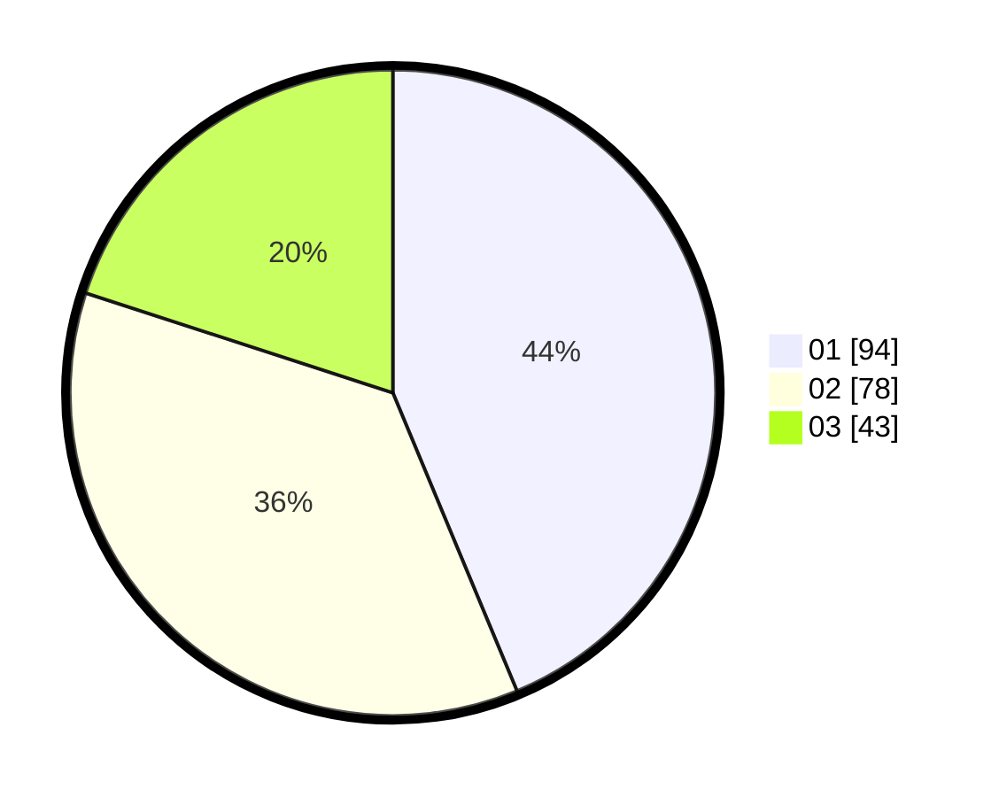

# Hasil

Hasil perolehan suara paslon dapat dilihat pada file paslon-01.txt, paslon-02.txt, dan paslon-03.txt.

Jika tidak ada, artinya data tersebut belum ada pada SIREKAP.

## Perolehan Suara

 * Paslon 01: **94**.
 * Paslon 02: **78**.
 * Paslon 03: **43**.

## Foto C Plano

https://sirekap-obj-formc.kpu.go.id/910d/pemilu/ppwp/31/73/05/10/01/3173051001049-20240214-155028--2ba0ba81-d794-46a7-a300-d10b9dec15b4.jpg

https://sirekap-obj-formc.kpu.go.id/910d/pemilu/ppwp/31/73/05/10/01/3173051001049-20240214-155536--7f8e0f1e-5ebf-4b00-a8ed-808925af9da4.jpg

https://sirekap-obj-formc.kpu.go.id/910d/pemilu/ppwp/31/73/05/10/01/3173051001049-20240214-155213--366c0f91-04d4-43d0-a4e0-412e54090b34.jpg

## DATA PEMILIH TETAP

Jumlah pemilih dalam DPT: **281**.
 * L: **131**.
 * P: **150**.

## DATA PENGGUNA HAK PILIH

Jumlah pengguna hak pilih dalam DPT: **215**.
 * L: **94**.
 * P: **121**.

Jumlah pengguna hak pilih dalam DPTb: **1**.
 * L: **1**.
 * P: **0**.

Jumlah pengguna hak pilih dalam DPK: **2**.
 * L: **1**.
 * P: **1**.

Jumlah pengguna hak pilih: **218**.
 * L: **96**.
 * P: **122**.

## JUMLAH SUARA SAH DAN TIDAK SAH

JUMLAH SELURUH SUARA SAH: **215**.

JUMLAH SUARA TIDAK SAH: **3**.

JUMLAH SELURUH SUARA SAH DAN SUARA TIDAK SAH: **218**.
