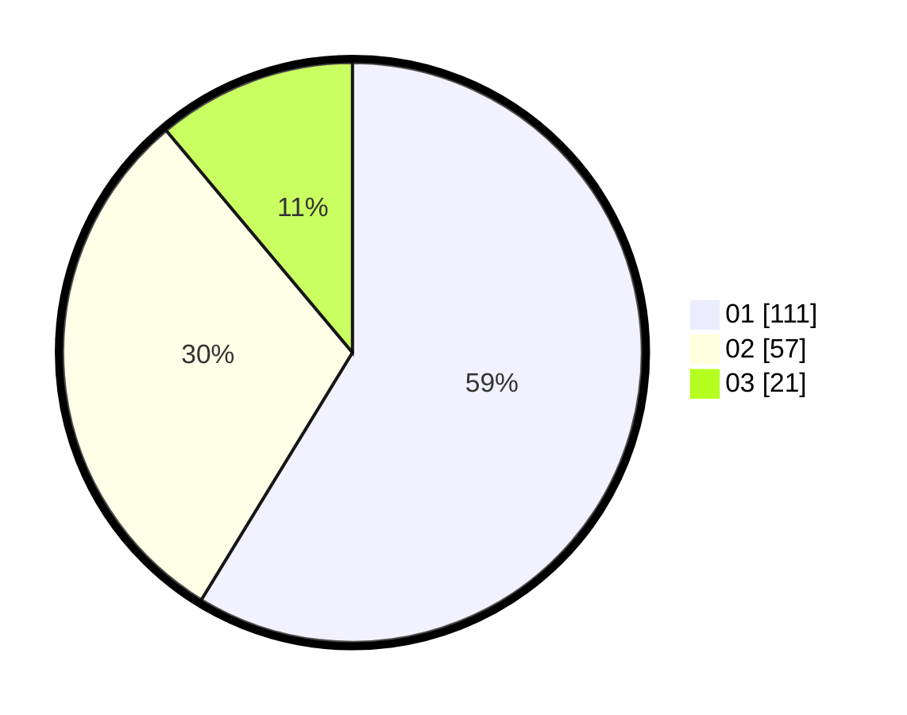

# Hasil

Hasil perolehan suara paslon dapat dilihat pada file paslon-01.txt, paslon-02.txt, dan paslon-03.txt.

Jika tidak ada, artinya data tersebut belum ada pada SIREKAP.

## Perolehan Suara

 * Paslon 01: **111**.
 * Paslon 02: **57**.
 * Paslon 03: **21**.

## Foto C Plano

https://sirekap-obj-formc.kpu.go.id/02ac/pemilu/ppwp/31/73/05/10/01/3173051001051-20240214-231622--a789c5d2-7ef2-4a7c-9db3-a912a41eda0a.jpg

https://sirekap-obj-formc.kpu.go.id/02ac/pemilu/ppwp/31/73/05/10/01/3173051001051-20240214-231655--7912fba3-0175-485d-892e-dbbf251a6088.jpg

https://sirekap-obj-formc.kpu.go.id/02ac/pemilu/ppwp/31/73/05/10/01/3173051001051-20240214-233306--ad6c7f9a-3ebf-49ae-b7d3-dbf7bc7dee96.jpg

## DATA PEMILIH TETAP

Jumlah pemilih dalam DPT: **277**.
 * L: **144**.
 * P: **133**.

## DATA PENGGUNA HAK PILIH

Jumlah pengguna hak pilih dalam DPT: **182**.
 * L: **91**.
 * P: **91**.

Jumlah pengguna hak pilih dalam DPTb: **0**.
 * L: **0**.
 * P: **0**.

Jumlah pengguna hak pilih dalam DPK: **5**.
 * L: **3**.
 * P: **2**.

Jumlah pengguna hak pilih: **187**.
 * L: **94**.
 * P: **93**.

## JUMLAH SUARA SAH DAN TIDAK SAH

JUMLAH SELURUH SUARA SAH: **183**.

JUMLAH SUARA TIDAK SAH: **4**.

JUMLAH SELURUH SUARA SAH DAN SUARA TIDAK SAH: **187**.
