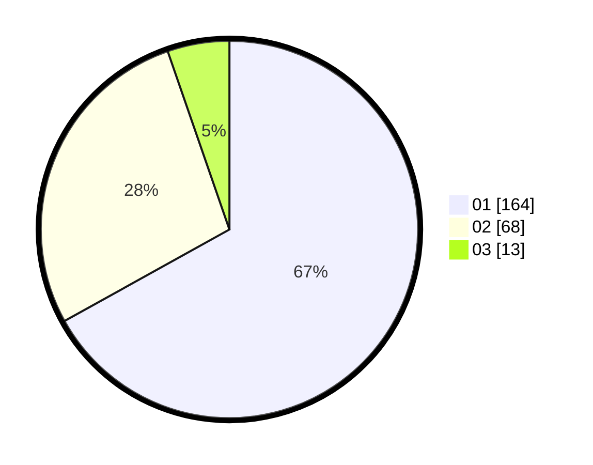

# Hasil

Hasil perolehan suara paslon dapat dilihat pada file paslon-01.txt, paslon-02.txt, dan paslon-03.txt.

Jika tidak ada, artinya data tersebut belum ada pada SIREKAP.

## Perolehan Suara

 * Paslon 01: **164**.
 * Paslon 02: **68**.
 * Paslon 03: **13**.

## Foto C Plano

https://sirekap-obj-formc.kpu.go.id/97de/pemilu/ppwp/31/73/05/10/01/3173051001054-20240215-025258--16baae07-81a7-4f5b-bad8-1baf2e3f0955.jpg

https://sirekap-obj-formc.kpu.go.id/97de/pemilu/ppwp/31/73/05/10/01/3173051001054-20240215-025830--df139e10-0f41-4385-be2a-fa231d30d25a.jpg

https://sirekap-obj-formc.kpu.go.id/97de/pemilu/ppwp/31/73/05/10/01/3173051001054-20240215-025950--59a481ef-a9d1-4525-88d7-8a6eb3ec268e.jpg
