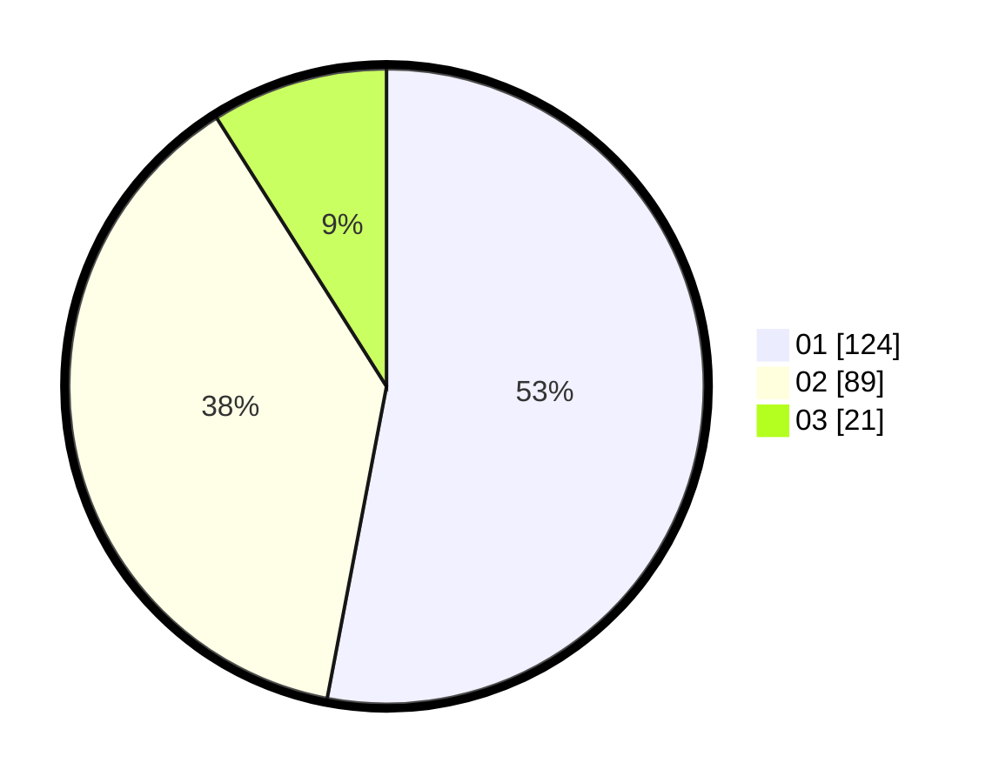

# Hasil

Hasil perolehan suara paslon dapat dilihat pada file paslon-01.txt, paslon-02.txt, dan paslon-03.txt.

Jika tidak ada, artinya data tersebut belum ada pada SIREKAP.

## Perolehan Suara

 * Paslon 01: **124**.
 * Paslon 02: **89**.
 * Paslon 03: **21**.

## Foto C Plano

https://sirekap-obj-formc.kpu.go.id/f833/pemilu/ppwp/31/73/05/10/01/3173051001055-20240214-194216--d6f489f7-1b18-4595-a84c-3f1f57d11c14.jpg

https://sirekap-obj-formc.kpu.go.id/f833/pemilu/ppwp/31/73/05/10/01/3173051001055-20240215-025835--521037b7-942d-4b7a-9837-c9e93859c8a1.jpg

https://sirekap-obj-formc.kpu.go.id/f833/pemilu/ppwp/31/73/05/10/01/3173051001055-20240215-023335--479e0101-90c1-462f-aa6c-9e102a3d56f8.jpg
