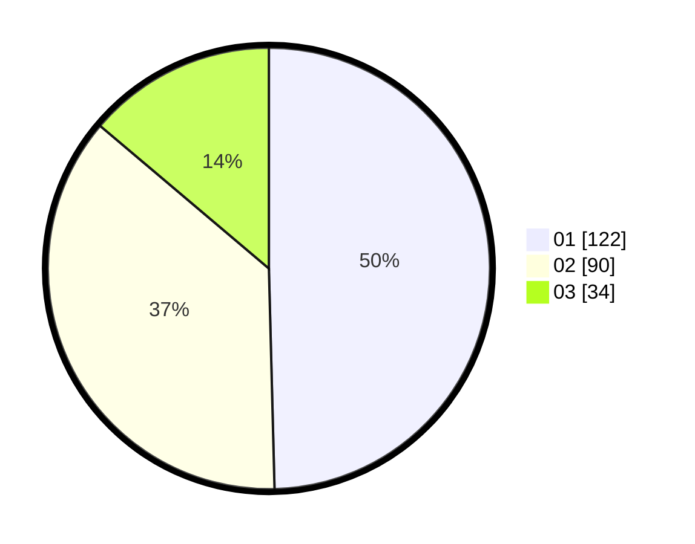

# Hasil

Hasil perolehan suara paslon dapat dilihat pada file paslon-01.txt, paslon-02.txt, dan paslon-03.txt.

Jika tidak ada, artinya data tersebut belum ada pada SIREKAP.

## Perolehan Suara

 * Paslon 01: **122**.
 * Paslon 02: **90**.
 * Paslon 03: **34**.

## Foto C Plano

https://sirekap-obj-formc.kpu.go.id/74dd/pemilu/ppwp/31/73/05/10/01/3173051001058-20240214-232535--1b7fdf85-4346-469e-aa7b-2578b6a5a32f.jpg

https://sirekap-obj-formc.kpu.go.id/74dd/pemilu/ppwp/31/73/05/10/01/3173051001058-20240214-232647--1cff9477-f9f5-417a-aab0-2bef077a6f6e.jpg

https://sirekap-obj-formc.kpu.go.id/74dd/pemilu/ppwp/31/73/05/10/01/3173051001058-20240214-232751--32e3233c-ae27-48bc-9608-ae6a9961ce69.jpg

## DATA PEMILIH TETAP

Jumlah pemilih dalam DPT: **294**.
 * L: **142**.
 * P: **152**.

## DATA PENGGUNA HAK PILIH

Jumlah pengguna hak pilih dalam DPT: **225**.
 * L: **106**.
 * P: **119**.

Jumlah pengguna hak pilih dalam DPTb: **5**.
 * L: **1**.
 * P: **4**.

Jumlah pengguna hak pilih dalam DPK: **16**.
 * L: **8**.
 * P: **8**.

Jumlah pengguna hak pilih: **246**.
 * L: **115**.
 * P: **131**.

## JUMLAH SUARA SAH DAN TIDAK SAH

JUMLAH SELURUH SUARA SAH: **246**.

JUMLAH SUARA TIDAK SAH: **0**.

JUMLAH SELURUH SUARA SAH DAN SUARA TIDAK SAH: **246**.
