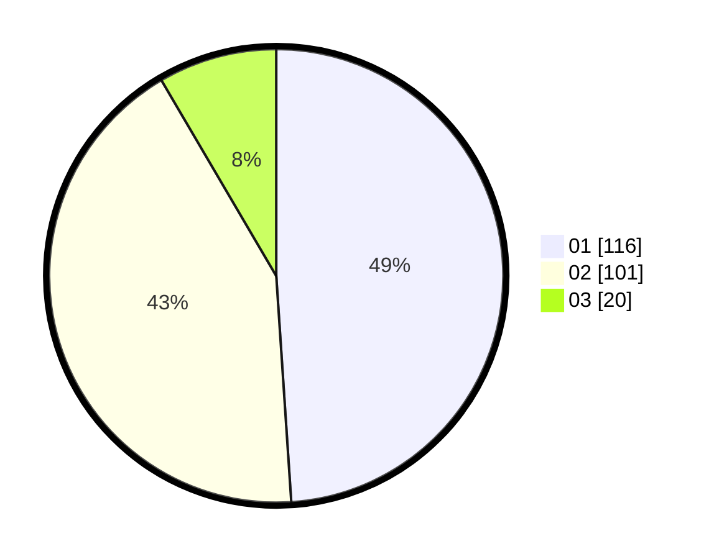

# Hasil

Hasil perolehan suara paslon dapat dilihat pada file paslon-01.txt, paslon-02.txt, dan paslon-03.txt.

Jika tidak ada, artinya data tersebut belum ada pada SIREKAP.

## Perolehan Suara

 * Paslon 01: **116**.
 * Paslon 02: **101**.
 * Paslon 03: **20**.

## Foto C Plano

https://sirekap-obj-formc.kpu.go.id/2c3e/pemilu/ppwp/31/73/05/10/01/3173051001059-20240214-234937--4bc83932-6a6b-449b-8914-96474ae13a49.jpg

https://sirekap-obj-formc.kpu.go.id/2c3e/pemilu/ppwp/31/73/05/10/01/3173051001059-20240214-235307--6160847d-5c20-45e8-86f3-3104e5194c39.jpg

https://sirekap-obj-formc.kpu.go.id/2c3e/pemilu/ppwp/31/73/05/10/01/3173051001059-20240214-235451--8f3a06c7-f3dc-4e7b-9d5e-3cc331195d48.jpg
