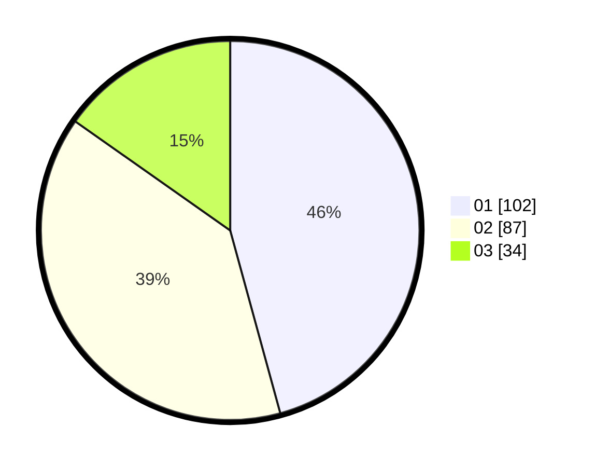

# Hasil

Hasil perolehan suara paslon dapat dilihat pada file paslon-01.txt, paslon-02.txt, dan paslon-03.txt.

Jika tidak ada, artinya data tersebut belum ada pada SIREKAP.

## Perolehan Suara

 * Paslon 01: **102**.
 * Paslon 02: **87**.
 * Paslon 03: **34**.

## Foto C Plano

https://sirekap-obj-formc.kpu.go.id/528f/pemilu/ppwp/31/73/05/10/01/3173051001065-20240215-014225--795aaace-8c22-4f72-a2d4-f916b7d4c156.jpg

https://sirekap-obj-formc.kpu.go.id/528f/pemilu/ppwp/31/73/05/10/01/3173051001065-20240215-014355--da4b7bd6-6c4c-4927-8625-e307c0fc9187.jpg

https://sirekap-obj-formc.kpu.go.id/528f/pemilu/ppwp/31/73/05/10/01/3173051001065-20240215-014609--65218301-6358-4d49-a696-1fcded8ddb1f.jpg
